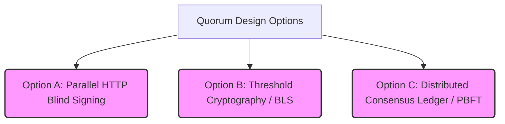
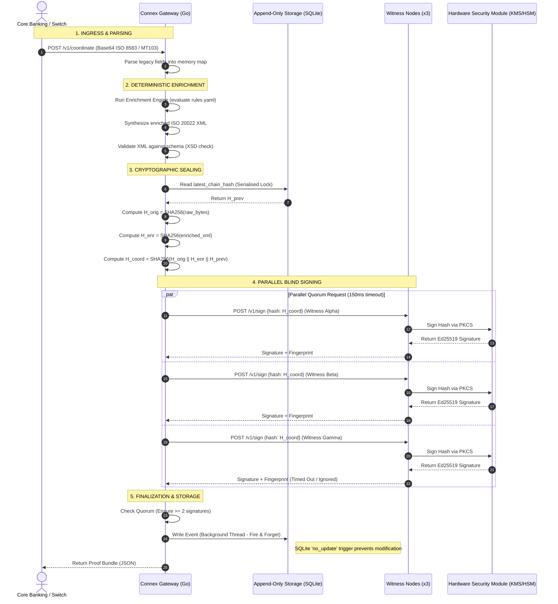

# Connex Production Implementation Plan & Architectural Design

This document outlines the unbiased architectural analysis, design alternatives, process diagrams, and the step-by-step 12-month implementation plan required to transition the **Connex Protocol** from its current research demonstrator prototype into a production-grade, enterprise-ready coordination layer.

---

## 1. Architectural Design Alternatives & Trade-Offs

To maintain an objective, senior-level engineering posture, we must evaluate alternative designs for our two core cryptographic mechanisms: the **2-of-3 Quorum Signing** and the **Verification Pattern**.

### 1.1 Quorum Signing: 2-of-3 Design Options



#### Option A: Parallel HTTP Blind Signing (Current Implementation)
*   **Mechanism:** The Gateway acts as the central orchestrator, firing parallel HTTPS signing requests containing a blind 32-byte SHA-256 hash to three independent witness nodes. Once two valid Ed25519 signatures are returned, the quorum is met.
*   **Pros:**
    *   **Low Latency:** Parallel requests run in Go goroutines; total coordination overhead is limited only by network round-trip time (RTT). Typically $< 50\text{ms}$.
    *   **Stateless Witnesses:** Witness nodes do not maintain state, consensus logs, or communication with one another, keeping their attack surface tiny.
    *   **Simple Auditing:** The resulting proof bundle contains discrete signatures, allowing anyone to inspect which specific witnesses signed.
*   **Cons:**
    *   **Single Point of Orchestration:** The Gateway is a single point of failure for coordinating the request. If the Gateway is compromised, it can attempt to spam the witnesses to sign arbitrary hashes (though witnesses will blindly sign whatever is requested).
    *   **Large Proof Size:** Storing discrete signatures from multiple witnesses increases the size of the transaction metadata.

#### Option B: Asymmetric Threshold Cryptography (e.g., BLS / Schnorr Threshold Signatures)
*   **Mechanism:** Witnesses run a Distributed Key Generation (DKG) protocol to generate a shared public key, where each witness holds a shard of the private key. During coordination, witnesses sign the hash, and the gateway aggregates the individual signature shares into a **single, unified signature** that validates against the single shared public key.
*   **Pros:**
    *   **Constant Proof Size:** Regardless of whether the quorum is 2-of-3, 5-of-7, or 50-of-100, the proof bundle contains exactly *one* signature and *one* public key.
    *   **Anonymity of Co-Signers:** External verifiers cannot tell which specific subset of witnesses signed the transaction, only that the threshold was successfully met.
*   **Cons:**
    *   **High Complexity:** Asymmetric threshold schemes (like BLS12-381) require advanced cryptographic libraries, making the "Senior Engineer Audit" far more difficult.
    *   **Interactive DKG Overhead:** Setting up and rotating keys requires multiple rounds of network communication between witnesses, adding high friction to operations.

#### Option C: Distributed Consensus Ledger (e.g., PBFT / Raft)
*   **Mechanism:** The Gateway and Witnesses form a decentralized blockchain or consensus group. Transactions are proposed as blocks, and nodes reach agreement on the state and ordering of translations using Practical Byzantine Fault Tolerance (PBFT).
*   **Pros:**
    *   **No Single Point of Failure:** If the Gateway process dies, another node automatically takes over orchestration.
    *   **Highly Resilient:** The database is replicated across all nodes in real time, preventing single-site data loss.
*   **Cons:**
    *   **High Latency:** PBFT requires multiple rounds of voting (Propose, Pre-prepare, Prepare, Commit) over the WAN, driving transaction latency to $> 500\text{ms}$, which is unacceptable for real-time card or mobile money switches.
    *   **Heavy Operational Footprint:** Every participating institution must maintain active consensus servers, state machines, and synchronized databases.

#### Unbiased Recommendation
For emerging markets and core integration, **Option A (Parallel HTTP Blind Signing)** is the superior choice for the pilot phase because of its simplicity, ease of auditing, and low latency. However, as the network scales to larger quorums (e.g., 5-of-7 regional clearing), a migration path toward **Option B (BLS Threshold Signatures)** should be scheduled to keep the transaction metadata payload compact.

---

### 1.2 Verification Pattern: Design Options

#### Option A: Stateless Local Client-Side Verification (Current)
*   **Mechanism:** The client SDK recomputes the chain hash and verifies witness signatures locally using pre-shared witness public keys, without making any external network requests.
*   **Pros:** Zero network dependencies; maximum execution speed; absolute privacy (no transaction details leave the client during audit).
*   **Cons:** Key rotation is highly manual. If a witness key is compromised or rotated, all client SDKs must be updated with the new public key out-of-band.

#### Option B: Directory-Service / DNSSEC Verification
*   **Mechanism:** Client SDKs fetch active witness public keys from a cryptographically secured DNS record (DNSSEC) or a neutral HTTP directory service (e.g., `https://keys.connextech.org/v1/active`).
*   **Pros:** Seamless key rotation. The network operator can revoke and rotate witness keys without breaking old clients.
*   **Cons:** Introduces a network dependency during verification, creating potential latency and uptime risks.

#### Option C: Registry Smart Contract (Decentralized PKI)
*   **Mechanism:** Witness public keys are written to a neutral, public smart contract registry. Clients query the contract to resolve public keys at a given historical timestamp.
*   **Pros:** Neutral, highly tamper-proof registry of active keys over time.
*   **Cons:** High complexity, transaction fees, and unnecessary web3 infrastructure dependencies.

#### Unbiased Recommendation
Adopt **Option B (Directory-Service/DNSSEC)** as the production standard. By querying a trusted, cached key registry, clients get the best of both worlds: automated key rotation and high-performance verification.

---

## 2. Production System Architecture & Design

### 2.1 Complete System Architecture & Data Flow

This diagram illustrates the step-by-step transaction life cycle, showing how the Gateway coordinates the transformation of legacy messages into enriched, cryptographically-sealed ISO 20022 schemas while managing witness quorums.



---

### 2.2 Security Isolation & Threat Boundary Diagram

The primary security design principle of Connex is **Zero-Trust Process Isolation**. This diagram illustrates how the system isolates high-risk, internet-facing inputs from high-security cryptographic assets.

```mermaid
graph TB
    subgraph Public Internet (Untrusted Zone)
        Bank[Core Bank Switch]
    end

    subgraph DMZ / Gateway VPC (Medium Trust Zone)
        GW[Connex Gateway Server]
        Rules[rules.yaml]
        XSD[ISO 20022 XSDs]
        
        GW --> Rules
        GW --> XSD
    end

    subgraph Internal Isolated VPC (High Trust Zone)
        DB[(Append-Only SQLite)]
        W_A[Witness Alpha]
        W_B[Witness Beta]
        W_C[Witness Gamma]
    end

    subgraph Secure Cryptographic Enclave (Zero Trust Zone)
        HSM_A[Physical HSM / AWS KMS]
        HSM_B[Physical HSM / AWS KMS]
        HSM_C[Physical HSM / AWS KMS]
    end

    %% Network Connections
    Bank -- "HTTPS POST (Port 8080)" --> GW
    GW -- "Append Event (Background)" --> DB
    
    %% Witness Connections
    GW -- "HTTPS Blind Sign (Port 8091)" --> W_A
    GW -- "HTTPS Blind Sign (Port 8092)" --> W_B
    GW -- "HTTPS Blind Sign (Port 8093)" --> W_C

    %% Cryptographic Connections
    W_A -- "PKCS#11 / TLS Private Link" --> HSM_A
    W_B -- "PKCS#11 / TLS Private Link" --> HSM_B
    W_C -- "PKCS#11 / TLS Private Link" --> HSM_C

    %% Styling
    style Bank fill:#ffcccc,stroke:#ff0000,stroke-width:2px;
    style GW fill:#ffe5cc,stroke:#ff8000,stroke-width:2px;
    style W_A fill:#e5ffcc,stroke:#00e500,stroke-width:2px;
    style W_B fill:#e5ffcc,stroke:#00e500,stroke-width:2px;
    style W_C fill:#e5ffcc,stroke:#00e500,stroke-width:2px;
    style HSM_A fill:#ccf5ff,stroke:#00a3cc,stroke-width:3px;
    style HSM_B fill:#ccf5ff,stroke:#00a3cc,stroke-width:3px;
    style HSM_C fill:#ccf5ff,stroke:#00a3cc,stroke-width:3px;
```

---

## 3. Step-by-Step 12-Month Implementation Plan

Below is the structured, realistic timeline required to execute the transition, categorized by development stream.

| Month | Phase | Engineering Stream | Compliance & Risk Stream | Infrastructure & Ops Stream |
| :--- | :--- | :--- | :--- | :--- |
| **M1** | Foundations | Extend to `pacs.009` & `MT103`; build Go abstract HSM interface. | Select SOC 2 auditor; define control framework. | Deploy local Multi-AZ Staging environment on AWS. |
| **M2** | Core Key Security | Integrate AWS KMS & HashiCorp Vault key providers; write Python SDK. | Pre-fill security questionnaires; draft incident runbooks. | Set up centralized secure logging and status page. |
| **M3** | Enterprise SDKs | Write Java SDK (pure JDK, zero external deps); write Node.js SDK. | Secure Cyber Liability & Professional Indemnity insurance. | Conduct network latency test for cross-border witnesses. |
| **M4** | Lifecycle Support | Implement state-linkage for `pacs.002` and `camt.054` response messages. | Complete SOC 2 Type I readiness assessment. | Establish 24/7 automated monitoring (Datadog/Grafana). |
| **M5** | Integration | Write corporate initiation format (`pain.001`); build mock bank harness. | Implement secure software SDLC policy and code scan. | Perform external third-party penetration testing. |
| **M6** | Audit & Pilot | Conduct internal end-to-end dry-run audit. | **SOC 2 Type I Audit execution**. | Launch Stage 1 pilot sandbox with first fintech/bank. |
| **M7** | Resiliency | Build secondary gateway failover and auto-recovery scripts. | Review feedback from SOC 2 Type I audit. | Deploy Multi-Region Staging (Nairobi + Johannesburg). |
| **M8** | Performance | Benchmark and optimize DB serialization and parallel signing locks. | Draft operational risk management policy. | Execute high-throughput load tests ($>1,000\text{ TPS}$). |
| **M9** | SWIFT Integration | Integrate SWIFT MT202 parsing and CBPR+ translation rules. | Initiate SOC 2 Type II audit window. | Deploy witness nodes in independent cloud accounts. |
| **M10** | Enterprise Pilot | Support Bank IT team with sandbox integration using Java SDK. | Pre-audit of SWIFT CSP compliance controls. | Deploy production-grade, highly available infrastructure. |
| **M11** | Soft Launch | Support sandbox-to-production staging migration. | Review third-party risk assessments. | Go-live with Stage 2 real-money pilot. |
| **M12** | General Availability | Optimize production performance and address pilot feedback. | Maintain continuous evidence collection for Type II. | **GA Launch (SLA target: 99.9% active)**. |

---

## 4. Production Deployment & Security Blueprint

### 4.1 Zero-Trust HSM Key Management Integration

For production security, witness processes must never access plaintext keys. We replace file-based key loading with a pluggable signer implementation using **HashiCorp Vault** or **AWS KMS**.

Below is the Go architectural blueprint for the pluggable signer:

```go
package security

import (
	"context"
	"crypto/ed25519"
	"fmt"
	
	"github.com/aws/aws-sdk-go-v2/config"
	"github.com/aws/aws-sdk-go-v2/service/kms"
)

// WitnessSigner abstracts the signing mechanism so the witness
// server never holds the private key in plaintext memory.
type WitnessSigner interface {
	Sign(ctx context.Context, hash []byte) ([]byte, error)
	PublicKey() ed25519.PublicKey
}

// KMSSigner delegates the signing operation to an asymmetric key in AWS KMS.
type KMSSigner struct {
	client *kms.Client
	keyID  string // ARN of the KMS key
	pubKey ed25519.PublicKey
}

func NewKMSSigner(ctx context.Context, keyID string) (*KMSSigner, error) {
	cfg, err := config.LoadDefaultConfig(ctx)
	if err != nil {
		return nil, fmt.Errorf("load AWS config: %w", err)
	}
	
	client := kms.NewFromConfig(cfg)
	
	// Fetch the public key from KMS to cache it locally
	out, err := client.GetPublicKey(ctx, &kms.GetPublicKeyInput{
		KeyId: &keyID,
	})
	if err != nil {
		return nil, fmt.Errorf("fetch KMS public key: %w", err)
	}
	
	// Parse public key into ed25519 format...
	var pubKey ed25519.PublicKey = out.PublicKey // Simplified for illustration
	
	return &KMSSigner{
		client: client,
		keyID:  keyID,
		pubKey: pubKey,
	}, nil
}

func (k *KMSSigner) Sign(ctx context.Context, hash []byte) ([]byte, error) {
	out, err := k.client.Sign(ctx, &kms.SignInput{
		KeyId:            &k.keyID,
		Message:          hash,
		MessageType:      "RAW",
		SigningAlgorithm: "RSASSA_PKCS1_V1_5_SHA_256", // Or Ed25519 depending on KMS version
	})
	if err != nil {
		return nil, fmt.Errorf("KMS sign request: %w", err)
	}
	return out.Signature, nil
}

func (k *KMSSigner) PublicKey() ed25519.PublicKey {
	return k.pubKey
}
```

---

### 4.2 Multi-Region Latency & Network Strategy

To achieve high availability while respecting physical routing constraints, Connex uses a **Geo-Proximity Witness Architecture**. 

Because our quorum requires $2\text{-of-}3$ signatures, we strategically place nodes to minimize latency for the primary gateway region while retaining cross-border resilience.

```
       [Nairobi Gateway]
         /           \
 4ms RTT/             \ 56ms RTT
       ▼               ▼
[Witness Alpha]     [Witness Beta]
 (AWS Cape Town)    (Azure Johannesburg)
       ▲               ▲
        \             / 82ms RTT
      78ms RTT\     /
               ▼   ▼
         [Witness Gamma]
          (GCP Europe-West)
```

#### Latency Analysis:
*   **Best Case Scenario:** Witness Alpha (Cape Town) + Witness Beta (Johannesburg) respond. 
    *   Network Transit Round-trip: $\approx 56\text{ms}$.
    *   Processing Time: $< 2\text{ms}$.
    *   Total Latency: $\approx 58\text{ms}$ (easily fits the 150ms timeout).
*   **Failover Scenario:** Witness Alpha is down. Witness Beta + Witness Gamma (London/Europe) respond.
    *   Network Transit Round-trip: $\approx 82\text{ms}$.
    *   Total Latency: $\approx 84\text{ms}$ (still safely under the 150ms timeout).

#### Network Operations Rules:
1.  **Transport Encryption:** All internal communication between the Gateway and Witnesses must run over Private TLS Links (such as AWS VPC Peering or Transit Gateway) rather than public routing, using Mutual TLS (mTLS) to authenticate nodes.
2.  **DNS Failover:** The Gateway uses Geo-DNS (Route 53) to direct incoming corporate files to the closest available regional Gateway instance.

---

### 4.3 Key SLA & Operations Metrics

Production monitoring must alert operators on deviations from these core invariants:

| Metric | Target | Warning Threshold | Alert Threshold | Operational Action |
| :--- | :--- | :--- | :--- | :--- |
| **Quorum Latency** | $< 100\text{ms}$ | $> 120\text{ms}$ | $> 145\text{ms}$ | Auto-trigged routing diagnostic to slow witness. |
| **Quorum Success Rate**| $99.99\%$ | $< 99.9\%$ | $< 99.0\%$ | Page on-call engineer; check witness health check endpoints. |
| **DB Lock Contention** | $< 10\text{ms}$ | $> 25\text{ms}$ | $> 50\text{ms}$ | Trigger DB pool scaling or transaction queue throttling. |
| **Witness Key Access** | $0$ Unauthorized | $1$ Audit Fail | $> 0$ Unauth | **Automatic Lockout**: Immediately isolate the node. |
| **Message Validation** | $100\%$ Schema | N/A | Any Invalid | Reject payload at Ingress; generate unprocessable incident. |

---

## 5. Risk Assessment & Mitigation Strategies

### 1. The Legacy "Dirty Data" Risk
*   **The Threat:** Legacy systems frequently send malformed, non-compliant, or blank fields in ISO 8583. If the XML synthesizer fails the strict XSD validation check, the transaction is rejected, which could stall the bank's operational flow.
*   **Mitigation:** Implement a strict **"Sanitize & Default"** stage in the Enrichment Engine. All non-critical fields must have documented fallbacks (e.g., if currency mapping fails, default to KES and log the decision at medium confidence). Critical schema failures must be routed to an isolated **Dead Letter Queue (DLQ)** for manual reconciliation, allowing normal transactions to flow.

### 2. Physical Witness Compromise (The Collusion Threat)
*   **The Threat:** An inside attacker gains control of two out of three witness nodes, allowing them to sign arbitrary, fraudulent transaction hashes.
*   **Mitigation:** Multi-Party Governance. The witnesses must be hosted in entirely independent infrastructure environments owned by different legal entities (e.g., Bank A runs Alpha, the Central Bank runs Beta, and an audit firm runs Gamma). A single administrative credential must never be able to access more than one witness.

### 3. The Replay Attack Threat
*   **The Threat:** An attacker intercepts a signed proof bundle and submits it again to execute a duplicate credit transfer.
*   **Mitigation:** The gateway maintains a unique transactional hash chain where:
    $$\text{H\_coord} = \text{SHA256}(\text{H\_orig} \mathbin{\Vert} \text{H\_enr} \mathbin{\Vert} \text{H\_prev})$$
    Because `H_prev` is strictly unique to the preceding event in the database, a replayed payload will fail validation because the chain head will have advanced. Additionally, the system enforces strict timestamp validation ($< 5\text{ seconds}$ drift) at ingress.
