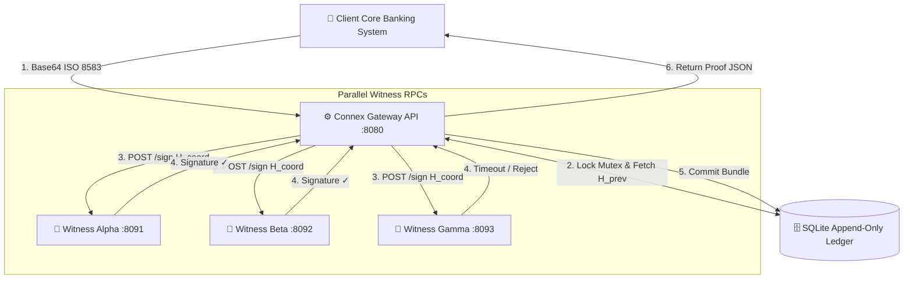
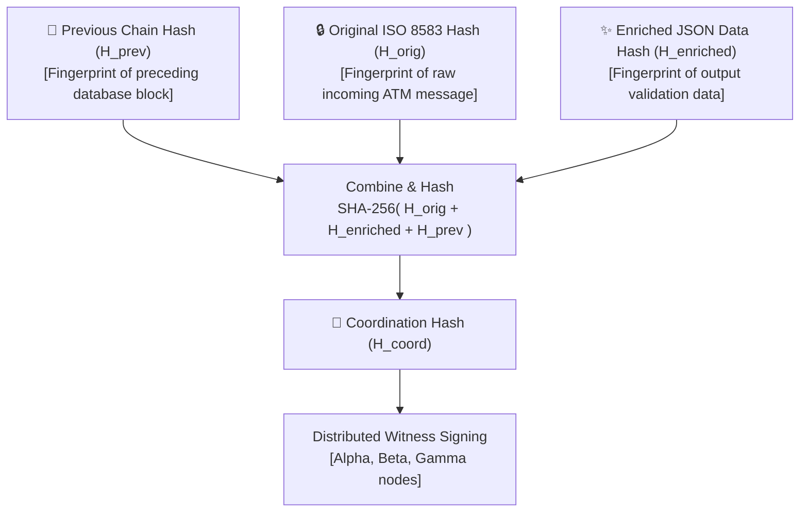

<picture>
  <source media="(prefers-color-scheme: dark)" srcset="connex_logo_dark.png">
  <source media="(prefers-color-scheme: light)" srcset="connex_logo_light.png">
  
</picture>

---

# Connex Architecture, Jargon & Design Decision Guide

This document is a dual-purpose guide. It is designed to help a beginner understand the system using simple real-world analogies, while simultaneously teaching the professional technical vocabulary (jargon) and design trade-offs that senior software engineers look for during audits.

---

## 1. The Core Architecture & Data Flow

At its heart, the Connex system takes legacy transaction inputs, validates and enriches them, collects cryptographic proofs from independent nodes, and records them in a tamper-proof database.

### The Transaction Hashing Chain
To prove that transaction history has not been altered, each new transaction binds the fingerprints of its data together with the fingerprint of the preceding transaction, forming a cryptographic chain.

---

## 2. Jargon vs. Analogy Glossary

Here are the key technical terms used in the Connex codebase. Each term is broken down into an everyday analogy, the technical jargon name, and the underlying computer mechanism.

### A. Core Ledger & Cryptography

| everyday analogy | technical jargon | underlying mechanic |
| :--- | :--- | :--- |
| **A notary seal on an envelope.** | **Cryptographic Signature (Ed25519)** | A mathematical proof generated using a **Private Key**. Anyone with the corresponding **Public Key** can verify the signature was created by that specific key and that the signed data has not changed. |
| **A unique paper shred fingerprint.** | **Cryptographic Hash (SHA-256)** | A one-way function that takes any amount of text/bytes and turns it into a fixed-size 32-byte string. It is impossible to reverse (guess the original data from the hash) or find two different inputs that produce the same hash. |
| **Signing a closed envelope without looking inside.** | **Blind Signing / Blind Notary** | The witness nodes only sign the **Coordination Hash** (`H_coord`), not the raw payload data. This guarantees customer data privacy and prevents witnesses from needing duplicate copies of the database or business validation rules. |
| **A book where pages are numbered and glued together.** | **Hash Chain** | Each database record contains the SHA-256 hash of the record that immediately preceded it. If an attacker tries to change the data in record #2, its hash will change, breaking the link to record #3, #4, and alerting auditors. |
| **A bank clerk who blocks anyone from erasing pages in a ledger.** | **Append-Only Database Triggers** | Database-level logic (`BEFORE UPDATE` and `BEFORE DELETE` triggers) that automatically aborts any SQL instruction attempting to edit or delete existing rows, even if a DBA or hacker has root access. |

### B. Distributed Systems & Concurrency (Go Primitives)

| everyday analogy | technical jargon | underlying mechanic |
| :--- | :--- | :--- |
| **A kitchen helper who runs to the pantry in parallel.** | **Goroutine** | A lightweight thread managed by the Go runtime (not the operating system kernel). It starts with only 2KB of stack memory, allowing you to spawn thousands of concurrent tasks without slowing down the server. |
| **A plastic pipe to roll tennis balls between helpers.** | **Channel (`chan`)** | A thread-safe communication pipe used to send variables between concurrent goroutines without encountering race conditions or requiring memory locks. |
| **A pipe that has a small bucket at the end so balls don't overflow.** | **Buffered Channel** | A channel configured with a set capacity (e.g. `make(chan result, 3)`). Spawns can write their outputs into the channel and immediately exit, preventing memory leaks if the main thread stops listening. |
| **A timer buzzer that stops a meeting if it runs too long.** | **Channel Select Timeout** | Combining a Go `select` block with `time.After(duration)`. If the witnesses do not return signatures within 150ms, the timeout channel fires first, and the system continues with whatever signatures it has collected. |
| **A keycard that only lets one person enter the vault room at a time.** | **Mutex Lock (`sync.Mutex`)** | Short for **Mutual Exclusion**. It serializes access to critical memory paths, preventing two concurrent web requests from querying the latest chain hash at the same millisecond and creating a duplicate/branched chain fork. |
| **Temporary scratchpads on a chef's counter vs. locked file cabinets.** | **Stack vs. Heap Memory** | **Stack memory** is fast, local, and automatically cleaned up when a function returns. **Heap memory** is global and persistent. In Go, if a variable needs to be shared outside its creating function, the compiler automatically moves it to the heap (called **escaping**). |

---

## 3. Why This Design? (Alternative Analysis)

Senior engineers will want to know **why** this architecture was modeled this way and why other standard designs were rejected. Use this matrix and analysis to defend the architecture.

### Comparative Technology Matrix

| Design Attribute | **Connex (This Design)** | **Distributed DB (Raft/Paxos)** | **Centralized DB (PostgreSQL)** | **Standard Blockchain** |
| :--- | :--- | :--- | :--- | :--- |
| **Primary Goal** | Low-latency message coordination with tamper evidence. | Automatic machine failover and state replication. | Centralized database queries and storage. | Trustless multi-party ledger synchronization. |
| **Write Latency** | **Low (<150ms)** | **Medium** (network sync latency) | **Low** (single server write) | **High** (minutes for blocks) |
| **Customer Privacy** | **High** (blind witness signing) | **Low** (replicated database nodes read all data) | **Medium** (limited by DB access controls) | **None** (all data is published transparently) |
| **Tamper Resistance** | **High** (tamper-evident hash chain + witness signatures) | **Low** (DB administrators can easily update rows) | **None** (DB root users have full delete power) | **High** (requires 51% network attack to alter) |
| **Setup Complexity** | **Minimal** (Single static binary, embedded SQLite) | **High** (Requires multiple server nodes, heartbeats) | **Medium** (Requires DB hosting, credentials) | **Extreme** (Requires node miners, smart contracts) |

### Rationale For Chosen Modelling:

1.  **Why SQLite (WAL) and not PostgreSQL/MySQL?**
    - *The Overkill Trap:* Traditional databases require installing separate background service processes, setting up users, passwords, and administering networking rules. 
    - *The Local Solution:* SQLite runs directly inside the Connex binary process, requiring **zero installation** or administrative setup. 
    - *Performance:* Running SQLite with Write-Ahead Logging (`PRAGMA journal_mode = WAL;`) allows multiple database readers to access transaction logs concurrently without blocking the writer thread, providing high throughput.
2.  **Why a 2-of-3 Witness Quorum and not a full Blockchain?**
    - *Performance and Cost:* Blockchains solve trust issues by having thousands of computers solve expensive math problems (proof-of-work) or lock up coins (proof-of-stake), resulting in long wait times (seconds to minutes) and costly transaction fees.
    - *Practical Security:* In a banking context, we know who our trusted partners are. By using 3 independent witness nodes and requiring at least 2 signatures (a 2-of-3 quorum), we ensure the system is resilient to a single node crash while maintaining **sub-150 millisecond response times**.
3.  **Why Blind Signing and not full data replication?**
    - *Data Leakage Risk:* If the witness nodes needed to read transaction details (names, amounts, accounts) to sign, they would become targets for hackers, violating customer privacy laws.
    - *Blind Signer Solution:* Witnesses only verify the integrity of the math. They sign a 32-byte hash. This keeps the witness logic extremely simple (lowering bug risk) and guarantees zero leak of sensitive financial data.

---

## 4. The Role of AI vs. Deterministic Rules in Banking

A common architectural question from senior auditors is: *"Why did you use a static rules engine instead of an AI model (like a Large Language Model or a neural network classifier) to enrich and translate these payment transactions?"*

In high-throughput, mission-critical financial software, **AI models are deliberately excluded from the critical transaction path** for three reasons:

### 1. Deterministic Execution vs. Probabilistic Guessing
*   **Deterministic (Chosen Design):** A rules engine is mathematical. If you input ATM Processing Code `01` and Amount `KES 1,500,000`, it will trigger `RULE-CBK-HIGH-VALUE-KES` and settle via RTGS **100% of the time**.
*   **AI (LLM / Classifier):** AI models are probabilistic. They choose outputs based on probabilities. If a model encounters a slightly skewed input layout, it might "hallucinate" or guess a different category code. In payment settlement, **a 99.9% accuracy rate is a failure**; a single misrouted transaction could violate AML compliance laws or misplace millions.

### 2. Microsecond Latency SLAs
*   **Rules Engine Execution:** Our Go compilation engine executes rules in memory in under **1 microsecond (0.001 milliseconds)**.
*   **AI Engine Execution:** Even the fastest local classifier or API query takes **50 to 500 milliseconds**. Adding half a second of latency per transaction at the gateway level makes it impossible to achieve the low-latency response times required by payment clearing networks.

### 3. Absolute Explainability (Provenance Audit Trail)
*   **Rules Engine Logging:** As shown in `docs/ENRICHMENT_ENGINE.md`, the engine returns a detailed ledger explaining the exact rule ID that generated each field outcome.
*   **AI Logging:** Neural networks are "black boxes." If a regulator asks, *"Why did this transaction get classified as a salary payment instead of a purchase of goods?"*, a neural network cannot answer beyond stating the statistical activation rates of its weights, which is legally unacceptable to central bank auditors.

### Where AI Safely Fits in the Connex Ecosystem

AI is highly valuable in Connex when deployed **outside the critical runtime path** (offline or asynchronously):

1.  **Rule Generation (Offline Compiler Assistant):**
    - AI is used to read large banking compliance PDF files (e.g. SWIFT updates) and automatically generate the YAML structures for `rules.yaml` rules. These are then human-reviewed, audited, and compiled into the Go binary.
2.  **Post-Facto Anomaly Detection (Asynchronous Auditing):**
    - An offline AI agent scans the SQLite database ledger logs in the background (off the main thread) to find complex fraud patterns, duplicate transactions, or money laundering loops that simple static rules cannot detect.
3.  **Synthetic Load Test Harness:**
    - AI generators produce thousands of realistic, synthetic ISO 8583 banking messages to simulate ATM stress-testing environments.
