<picture>
  <source media="(prefers-color-scheme: dark)" srcset="connex_logo_dark.png">
  <source media="(prefers-color-scheme: light)" srcset="connex_logo_light.png">
  
</picture>

---

# Go Programming: Learn by Reading CONNEX
### A Beginner's Course Built From a Real Banking System

Welcome to the world of coding! If you have never written a single line of code before, you are in the right place. 

## What is Programming?
A computer is like a very fast but completely obedient calculator. It does exactly what we tell it to do, but it has no common sense. A **program** is a list of step-by-step instructions—like a cooking recipe—written in a text file that tells the computer exactly what to do.

- **Source Code (or Code):** The instructions we write using words and symbols. We write this in English-like terms that humans can read.
- **Go (or Golang):** The programming language we are using. It was created at Google to build large, secure systems like search engines and bank networks.
- **The Compiler:** Computers do not understand English. They only understand tiny electrical switches that are either ON (1) or OFF (0). The compiler is a translation program. It reads our Go files (ending in `.go`) and translates them into a binary file (an "executable") that the computer's processor can run.
- **Running a Program:** When we tell the computer to execute (run) the translated instructions.
- **The Terminal (or Command Line):** A text-based screen where we type commands to tell the computer to compile or run our programs.

---

## How This Course Was Built — The Science of Learning

Every section uses techniques proven by cognitive science to make learning stick:

```
┌─────────────────────────────────────────────────────────────────────────┐
│                    8 TECHNIQUES IN THIS COURSE                          │
├───────────────────────┬─────────────────────────────────────────────────┤
│  Active Recall        │  Write it yourself before seeing the answer     │
│  Spaced Repetition    │  Review checkpoints bring old topics back       │
│  Interleaving         │  Later quizzes mix multiple chapters together   │
│  Feynman Technique    │  "Teach It Back" prompt after every chapter     │
│  Elaborative Inquiry  │  "Ask Why?" section after every real code block │
│  Concrete Examples    │  Analogy before definition, every time          │
│  Chunking             │  One concept per chapter, never more            │
│  Immediate Practice   │  Quiz appears right after the lesson            │
└───────────────────────┴─────────────────────────────────────────────────┘
```

> ⚠️ **Safety Rule:** Create a folder called `sandbox/` on your Desktop. ALL practice goes there. Never edit `cmd/` or `internal/`. You cannot break the bank from your sandbox.

---

## The Big Picture — What You Are Learning To Read

Before you write a single line, understand what CONNEX actually is:

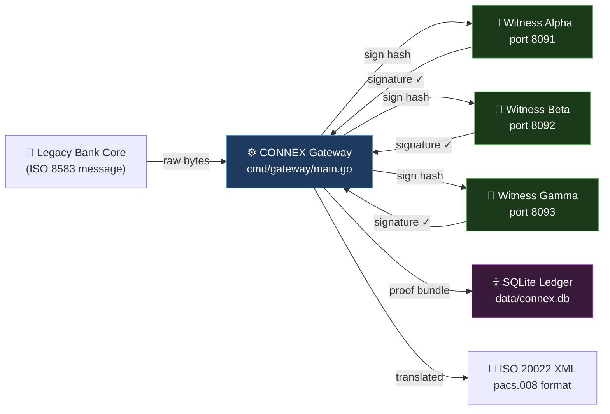

**This course teaches you Go by reading every file shown above, line by line.**

---

## Your Study Roadmap

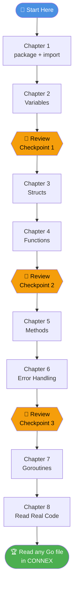

---

---

# Chapter 1: Packages and Imports

---

## 📖 The Analogy

Imagine you are a head chef setting up a new restaurant kitchen:

1. **You declare the kitchen:** "This is the MAIN kitchen, which produces the actual meals, not a prep room that just chops onions."
2. **You gather your tools:** You need a knife, a pot, a timer, and a scale from the storage closet.

In Go, every program does the exact same thing:

- **`package main`** = "This is the main kitchen." It tells the compiler: "This code is a runnable program. This is where the application starts."
- **`import (...)`** = "Gathering our tools." It tells the compiler: "We need tools from the standard library storage closet."

---

## How Imports Work — Visual representation

Go comes with a built-in "pantry" of pre-made tools called the **Standard Library**. You do not need to write tools for cryptography or web servers from scratch; you just borrow them:

```
  The Go Standard Library (built-in toolboxes)
  ┌────────────────────────────────────────────────────────────┐
  │                                                            │
  │  crypto/          encoding/       net/         os          │
  │  ├── ed25519      ├── base64      └── http     log/slog   │
  │  ├── rand         ├── hex                      flag        │
  │  └── sha256       └── json        time         fmt         │
  │                                   path/filepath            │
  └────────────────────────────────────────────────────────────┘
              │                │                │
              ▼                ▼                ▼
        cmd/witness/main.go imports only what it needs:
        "crypto/ed25519", "fmt", "net/http", "time", ...
```

---

## 🔍 Real Code — `cmd/witness/main.go` Lines 11–27

Here is how a real bank security server starts in Go:

```go
package main

import (
    "crypto/ed25519"   // 🔑 Cryptographic signatures (verifying bank identity)
    "crypto/rand"      // 🎲 Cryptographic random number generator (for generating keys)
    "crypto/sha256"    // 🔒 SHA-256 hashing (creating secure fingerprints of data)
    "encoding/base64"  // 📝 Converts raw binary bytes into readable text like "SGVsbG8="
    "encoding/hex"     // 🖊️  Converts raw binary bytes into hex numbers like "3f8a1c"
    "encoding/json"    // 📋 Reads and writes JSON format (standard internet text data)
    "flag"             // 🚩 Reads options typed in the terminal (like --port=8091)
    "fmt"              // 🖨️  Prints text to the screen (formatted print)
    "log/slog"         // 📓 Creates structured log records (like [info] time=... msg="server started")
    "net/http"         // 🌐 Builds a web server to receive HTTP requests
    "os"               // 💾 Interacts with the computer's Operating System (files, folders)
    "path/filepath"    // 📁 Manages file paths (safely handles folders on Windows vs Linux)
    "time"             // ⏰ Calculates dates, times, and timeouts
)
```

### Let's Decode the Syntax:
- **`package main`**: Declares that this file is the main executable program.
- **`import (...)`**: Opens a list of toolboxes to bring in. Each path in quotes (like `"fmt"`) is a package name.
- **Comments (`//`)**: Any text following `//` is ignored by the computer. They are helpful notes written by programmers to explain the code.
- **Double quotes (`""`)**: Strings of text in Go must be surrounded by double quotes.

---

## ❓ Ask Why?

- **Why does Go refuse to compile if you import a toolbox and never use it?**
  *Answer:* Unused imports slow down the compile process and make the final application file unnecessarily large. More importantly, in bank security, every unused line of code is a potential place for bugs or security holes. Go prevents this at the compiler stage!
- **Why does `"crypto/sha256"` use a `/` and not a dot like other languages?**
  *Answer:* It tells Go the folder structure where the toolbox is located. It is inside a folder named `crypto`, inside a subfolder named `sha256`.

---

## 🧠 Feynman Check

Close this file. Take a piece of paper or open a notepad and explain to a non-programmer: *"What does `package main` mean, and what is `import`?"* (Explain it as if explaining to a 10-year-old child).

---

## ✏️ Quiz 1: Creating your first Go program

Open your terminal or file manager, and navigate to your `sandbox/` directory. Create a new text file named `quiz1.go`.

Write a program that:
1. Declares `package main`.
2. Imports two toolboxes: `fmt` (for printing text) and `time` (for checking the clock).
3. Tells the computer where to start running using the main entry point:
   ```go
   func main() {
       // your instructions go here
   }
   ```
4. Prints the message: `"CONNEX Witness — Online"`.
5. Prints: `"Current time:"` followed by the actual current time.

*Hint: You can print the current time using `time.Now()`, and you print to the screen using `fmt.Println(...)`.*

Run your code by opening your terminal in the sandbox folder and typing:
`go run quiz1.go`

---

## ✅ Answer — Quiz 1

Here is the complete code:

```go
package main

import (
    "fmt"
    "time"
)

//# Chapter 2: Variables, Pointers, Slices, Maps & Encoding

---

## 📖 The Analogy: Computer Memory & Variables

Inside your computer is a component called **RAM** (Random Access Memory), which acts as the computer's short-term memory. 

Imagine RAM as a massive room filled with rows of numbered storage drawers. Each drawer has a unique number stamped on it (its **Memory Address**).

```
   Memory Box #1024       Memory Box #1025       Memory Box #1026
  ┌──────────────────┐   ┌──────────────────┐   ┌──────────────────┐
  │      "Equity"    │   │       1247       │   │     98750.50     │
  │  (string/text)   │   │  (int/integer)   │   │ (float64/decimal)│
  └──────────────────┘   └──────────────────┘   └──────────────────┘
```

If we had to refer to memory drawers by their numbers (like "put 100 in box #1025"), writing code would be incredibly difficult. Instead, we use **Variables**. 

A **Variable** is simply a human-friendly label we tape onto a drawer. 

When you write `bankName := "Equity"`, Go automatically:
1. Finds an empty drawer in the room (say box `#1024`).
2. Tapes the name label `bankName` on the outside of the drawer.
3. Slips the text value `"Equity"` inside the drawer.

---

## Data Types — The Rule on What Fits Inside

You cannot put soup in a shoe box or shoes in a soup bowl. Similarly, computers require different kinds of boxes for different kinds of information. These are called **Data Types**:

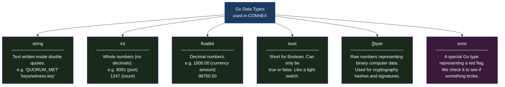

### The Magic Operator: `:=` vs `=`
Go has two ways to put data into variables:

1. **`:=` (Create and Assign):** This is the **short declaration operator**. It tells Go: "Create a brand-new variable box, guess what type of data belongs in it based on what I write, and put that data in."
   ```go
   balance := 50000.75  // Go creates a float64 variable named balance
   ```
2. **`=` (Assign value to an existing box):** Once a variable is already created, you cannot use `:=` on it again. You must use `=` to replace the value inside.
   ```go
   balance = 65000.20  // Updates the existing balance box. No colon (:) is used.
   ```

*Strict Rule:* In Go, once a box is created for a certain data type, it can **never** change its type. If `balance` is created as a decimal number (`float64`), you can never put text `"insolvent"` inside it. Go will refuse to compile!

---

## Pointers: What Are They?

A **Pointer** is a variable that does not store actual data like numbers or text. Instead, it stores the **Memory Address (the drawer number)** of another variable.

Think of a pointer as a **paper index card** with a drawer number written on it.

```
   Original Variable Box:
   ┌────────────────────────────────┐
   │ Box #1025: count = 1247        │
   └────────────────────────────────┘
     ▲
     │ (pointing to)
   ┌────────────────────────────────┐
   │ pointerToCount := &count       │  --> holds the card writing "#1025"
   └────────────────────────────────┘
```

To use pointers, Go gives us two basic operators:

- **`&` (Address-of Operator):** Reads the label on a variable's drawer to get its drawer number. Think of `&` as asking: **"Where is this variable located?"**
- **`*` (Dereference Operator):** Goes to the drawer number written on the card, opens it, and lets you read or change what is inside. Think of `*` as asking: **"Open the drawer at this address."**

### Why do we need pointers in bank software?
When you pass information to a task (a function), Go's default behavior is to **copy** everything. If you have a large transaction packet with hundreds of fields, copying it over and over again eats up computer memory and slows down the system.

Instead of copying the entire transaction, we just write its memory address on a pointer card (which takes almost zero memory) and pass the card. The program can read or modify the original transaction directly using that card.

---

## Slices vs. Arrays: Managing Lists

In banking, we handle lists of things: lists of signatures, lists of ledger entries, lists of bytes.

1. **Array:** A fixed-length row of drawers. Once created, you cannot change its size. It is like an egg carton that holds exactly 12 eggs.
   `var hash [32]byte` -> exactly 32 bytes, no more, no less.
2. **Slice:** A flexible, resizable view of a list. It can grow or shrink as needed.
   `var signatures []SignatureEntry` -> a list of signatures that grows as witnesses sign.

### How a Slice Works Under the Hood
A slice is actually a small manager that keeps track of three values:
1. **Pointer:** The memory address where the list starts on the computer.
2. **Length (`len`):** How many items are currently in the list.
3. **Capacity (`cap`):** The maximum number of items the list can hold before running out of room.

Think of a slice as a **measuring cup**:
- If you have a 10-ounce measuring cup (Capacity = 10) containing 2 ounces of water (Length = 2).
- When you use the built-in Go function `append(slice, newItem)`, Go pours a new item into the container.
- If you exceed the capacity (pour more than 10 ounces), Go automatically:
  1. Finds a new, larger storage space in memory (usually double the size).
  2. Copies all the existing items to the new space.
  3. Appends the new item.
  4. Updates the slice pointer to point to the new location.

---

## Maps: Key-Value Storage

A **Map** is like a physical index card cabinet. 

To find a card, you look it up by a label called a **Key** (for example, Field `4` in a bank message). Once you find that card, you read the **Value** written on it (for example, the transaction amount `"000000100000"`).

In Go, we declare a map like this:
`map[KeyType]ValueType`
Example: `Fields map[int]string` -> keys are whole numbers, values are text.

### The "Comma OK" Check
If you look up a card that does not exist in the map, Go does not crash. Instead, it returns a blank value (like `""` for text or `0` for numbers). 

In banking, we must know if a field is genuinely blank, or if it was simply never sent by the ATM. We check this using the **comma ok** syntax:

```go
value, ok := myMap[key]
```
- If `ok` is `true`, the card was found in the map, and its contents are in the variable `value`.
- If `ok` is `false`, the card was not found in the map at all.

---

## Computers and Binary: What is a Bit and a Byte?

Before we look at bank data, we must understand how computers store numbers:

- **Bit (Binary Digit):** The smallest unit of data. It is a single light switch that can only be `0` (OFF) or `1` (ON).
- **Byte:** A group of **8 bits** grouped together. A byte can represent any number from `0` to `255` in binary (base-2) format.
  ```
  Byte representation of the number 13:
  Bit position:   128   64   32   16    8    4    2    1
  Switch state:    0    0    0    0    1    1    0    1   --> (8 + 4 + 1 = 13)
  ```

---

## ASCII vs. BCD: How Banks Save Network Bandwidth

Legacy bank systems and ATMs communicate using a format called **ISO 8583**. To save network costs and bandwidth, they compress numbers using **BCD (Binary Coded Decimal)**.

Let's look at how the number `1234` is sent across the wire in two different ways:

### 1. ASCII Encoding (Standard Text)
In standard text format, each character takes exactly **1 byte (8 bits)** of data:
- Character `'1'` is stored as byte `00110001` (hex value `0x31`)
- Character `'2'` is stored as byte `00110010` (hex value `0x32`)
- Character `'3'` is stored as byte `00110011` (hex value `0x33`)
- Character `'4'` is stored as byte `00110100` (hex value `0x34`)
- **Total size: 4 bytes (32 bits)**

### 2. BCD Encoding (Binary Coded Decimal)
Since a digit from 0 to 9 only requires 4 bits of binary space (`9` is `1001`), we can pack **two digits** into a single byte! We split a byte into two 4-bit halves (called **nibbles**):
- Byte 1 holds digits `1` and `2`: `0001` (1) and `0010` (2) -> byte is `00010010` (hex `0x12`)
- Byte 2 holds digits `3` and `4`: `0011` (3) and `0100` (4) -> byte is `00110100` (hex `0x34`)
- **Total size: 2 bytes (16 bits) — 50% savings!**

### Bit Shifting: How We Decode BCD in Go
If the network sends us a byte `0x12` (`00010010`), how do we separate the two digits `1` and `2`? We use bitwise operators:

1. **Getting the First Digit (High Nibble):** We shift all the bits to the right by 4 positions.
   - Original byte: `00010010`
   - Shift right by 4 (`>> 4`): `00000001` (which is the number `1`)
   - In Go: `digit1 := b >> 4`
2. **Getting the Second Digit (Low Nibble):** We clear out (mask) the first 4 bits, keeping only the last 4 bits. We do this using a bitwise AND operator (`&`) with the binary value `00001111` (which is written as `0x0F` in hex).
   - Original byte: `00010010`
   - AND with `0x0F`:   `00001111`
   - Result:          `00000010` (which is the number `2`)
   - In Go: `digit2 := b & 0x0F`

---

## 🔍 Real Code — `cmd/witness/main.go` Lines 34–35

Let's look at variables in the real CONNEX codebase:

```go
privPath := keyPath          // Creates a new box "privPath" and copies the value of keyPath inside.
pubPath  := keyPath + ".pub" // Creates a new box "pubPath", copies keyPath, and glues ".pub" to the end.
```

Let's dissect the `:=` short variable declaration operator:

```
  privPath  :=  keyPath
  ────────  ──  ───────
  Create     Do  Copy the
  a new box  it  value in
  named      at  here
  privPath   the
             same
             time
```

If `keyPath` contains `"keys/witness.key"`, this code creates two new variable boxes:
```
  Before:          After:
  ┌──────────┐     ┌──────────────────┐  ┌────────────────────────┐
  │ keyPath  │     │    privPath      │  │       pubPath          │
  │          │ ──► │                  │  │                        │
  │"keys/    │     │"keys/witness.key"│  │"keys/witness.key.pub"  │
  │witness   │     └──────────────────┘  └────────────────────────┘
  │.key"     │
  └──────────┘
```

---

## 🔍 Real Code — Unique Bundle ID — `cmd/gateway/main.go` Line 198

When a transaction occurs, the system generates a unique identifier:

```go
bundleID := fmt.Sprintf("CX-%s-%x", time.Now().UTC().Format("20060102150405.000000"), randBytes)
```

Let's break this down piece by piece:
- **`fmt.Sprintf(...)`**: A function that formats and glues text together, returning it as a string instead of printing it to the screen.
- **`"CX-%s-%x"`**: The format template.
  - `%s` means: "insert a text string here".
  - `%x` means: "convert these binary bytes into hexadecimal text characters and insert here".
- **`time.Now().UTC()`**: Checks the current date and time using Universal Coordinated Time (UTC).
- **`.Format("20060102150405.000000")`**: Formats the date. In Go, we format time by showing how a specific reference date (Jan 2, 2006 at 3:04:05 PM) should look. This translates to `YearMonthDayHourMinuteSecond.Microseconds` (e.g. `"20260522154100.000000"`).
- **`randBytes`**: 4 random binary bytes (e.g., `0x3f, 0x8a, 0x1c, 0x2b` which prints as hex `"3f8a1c2b"`).

Resulting String: `"CX-20260522154100.000000-3f8a1c2b"`

---

## 🔍 Real Code - BCD Decoding in `internal/iso8583/parser.go`

Here is the real parser code that decodes raw BCD bytes back into standard readable text:

```go
func decodeBCD(bytes []byte, digits int) string {
    var sb strings.Builder // strings.Builder is an empty text sheet where we glue text
    for _, b := range bytes {
        // Loops through each byte "b" in our list of bytes
        sb.WriteString(fmt.Sprintf("%02x", b))
        // %02x prints the byte as a hexadecimal number (e.g. byte 0x12 becomes text "12")
    }
    val := sb.String() // Converts our text sheet into a standard string
    if len(val) > digits {
        val = val[:digits] // Trims off any extra padding digits
    }
    return val // Returns the decoded text
}
```

---

## ❓ Ask Why?

- **Why does CONNEX store money amounts as `float64` instead of integer cents?**
  *Answer:* The Gateway converts raw ATM cents (like `100000`) into standard decimal floats (like `1000.00`) to match the international bank standard ISO 20022 XML format. In internal accounting ledgers, however, integers are always preferred because floating-point numbers can occasionally suffer from rounding errors in CPU registers!
- **Why does Go's time layout use `"20060102"` instead of `"YYYYMMDD"`?**
  *Answer:* Go's designers wanted a layout where you write a real sample date. They chose Jan 2, 2006 (01/02 03:04:05 PM 2006). If you count the numbers, they form a sequence: `1` (month), `2` (day), `3` (hour), `4` (minute), `5` (second), `6` (year).

---

## ✏️ Quiz 2A: Variable & Pointer Manipulation

Create a new file named `sandbox/quiz2a.go`. Write a program that:
1. Declares a variable `balance` of type `float64` with an initial value of `50000.75`.
2. Declares a pointer variable `p` that stores the address of `balance` using the `&` operator.
3. Prints the memory address stored in `p` (use `%p` in `fmt.Printf`) and the actual value stored at that address using the `*` operator.
4. Changes the balance value to `65000.20` by modifying what is inside the drawer using the pointer `p` (use the `*` operator).
5. Prints the new value of `balance` directly.

To run it, type: `go run quiz2a.go`

---

## ✅ Answer — Quiz 2A

```go
package main

import "fmt"

func main() {
    balance := 50000.75
    p := &balance // p holds the memory address (pointer) of balance

    fmt.Printf("Memory address: %p\n", p)
    fmt.Printf("Value at address: %.2f\n", *p) // *p opens the drawer to read the value

    *p = 65000.20 // opens the drawer at address p and overwrites the contents

    fmt.Printf("Updated balance: %.2f\n", balance)
}
```

**Expected Output:**
```
Memory address: 0xc0000120b8 (this hex number will change every time you run the program)
Value at address: 50000.75
Updated balance: 65000.20
```

---

## ✏️ Quiz 2B: Slices & Capacity

Create a new file named `sandbox/quiz2b.go`. Write a program that:
1. Declares a slice of strings named `witnesses` containing `"alpha"` and `"beta"`.
2. Prints its current length (`len`) and capacity (`cap`).
3. Appends the string `"gamma"` to the slice.
4. Prints the new length and capacity.
5. Appends `"delta"` and `"epsilon"`.
6. Prints the final length, capacity, and contents of the slice.

---

## ✅ Answer — Quiz 2B

```go
package main

import "fmt"

func main() {
    witnesses := []string{"alpha", "beta"}
    fmt.Printf("Start: len=%d, cap=%d, contents=%v\n", len(witnesses), cap(witnesses), witnesses)

    witnesses = append(witnesses, "gamma")
    fmt.Printf("After 1 append: len=%d, cap=%d, contents=%v\n", len(witnesses), cap(witnesses), witnesses)

    witnesses = append(witnesses, "delta", "epsilon")
    fmt.Printf("After 3 appends: len=%d, cap=%d, contents=%v\n", len(witnesses), cap(witnesses), witnesses)
}
```

**Expected Output:**
```
Start: len=2, cap=2, contents=[alpha beta]
After 1 append: len=3, cap=4, contents=[alpha beta gamma]
After 3 appends: len=5, cap=8, contents=[alpha beta gamma delta epsilon]
```

**Beginner Pitfall to Notice:** 
Notice that the capacity doubled from 2 to 4 when we appended `"gamma"`, and then from 4 to 8 when we appended `"delta"` and `"epsilon"`. Under the hood, Go allocated a brand new array in memory, copied the data, and updated the slice header automatically.

---

## ✏️ Quiz 2C: Maps & "Comma OK" check

Create a new file named `sandbox/quiz2c.go`. Write a program that:
1. Creates a map named `isoFields` where keys are integers (`int`) and values are strings (`string`).
2. Inserts key `3` with value `"310100"` (Processing Code) and key `4` with value `"000000500000"` (Amount).
3. Looks up key `4` using the "comma ok" syntax and prints whether it was found.
4. Looks up key `11` (STAN) using the "comma ok" syntax and prints whether it was found.

---

## ✅ Answer — Quiz 2C

```go
package main

import "fmt"

func main() {
    // make initializes a map so it is ready to store data
    isoFields := make(map[int]string)
    isoFields[3] = "310100"
    isoFields[4] = "000000500000"

    // Lookup with comma ok check
    val4, ok4 := isoFields[4]
    if ok4 {
        fmt.Printf("Field 4 found: %s\n", val4)
    } else {
        fmt.Println("Field 4 not found!")
    }

    val11, ok11 := isoFields[11]
    if ok11 {
        fmt.Printf("Field 11 found: %s\n", val11)
    } else {
        fmt.Println("Field 11 not found (returned empty string: \"" + val11 + "\")")
    }
}
```

**Expected Output:**
```
Field 4 found: 000000500000
Field 11 not found (returned empty string: "")
```

---

## 🔄 Review Checkpoint 1

Answer these questions from memory:
1. What is a variable, and how does it relate to computer memory (RAM)?
2. What does `:=` do that `=` cannot?
3. What is a pointer, and how do `&` and `*` work?
4. What is the difference between length (`len`) and capacity (`cap`) in a slice?
5. How does the "comma ok" syntax check if a map contains a key?
6. Explain why packed BCD uses half the bytes of ASCII to store numbers.

---


# Chapter 3: Structs — Grouping Related Data

---

## 📖 The Analogy: Blank Paper Forms

In a bank, a single transaction consists of many related pieces of information: who sent the money, who received it, the amount, and the time. 

Storing all of these in separate individual variables would be incredibly messy and easy to mix up.

A **Struct** (short for Structure) is like a **blank paper form** (such as a deposit slip). 

```
  CONNEX PROOF BUNDLE FORM (The Struct)
  ══════════════════════════════════════════════════════
  Bundle ID     │  [                                   ]
  ──────────────┼───────────────────────────────────────
  Timestamp     │  [                                   ]
  ──────────────┼───────────────────────────────────────
  Original Hash │  [                                   ]
  ──────────────┼───────────────────────────────────────
  Enriched Hash │  [                                   ]
  ──────────────┼───────────────────────────────────────
  Quorum Status │  [                                   ]
  ════════════════════════════════════════────────────────
```

1. **Defining the Struct:** We design the blank layout once, specifying what fields the form has and what type of data goes in each field.
2. **Instantiating the Struct:** Filling out a fresh copy of the form with actual data. Each filled-out form is called an **instance**.

---

## How Structs Relate to Each Other

A form can contain other forms inside it. For example, a transaction `Bundle` form contains a list (slice) of witness signature forms:

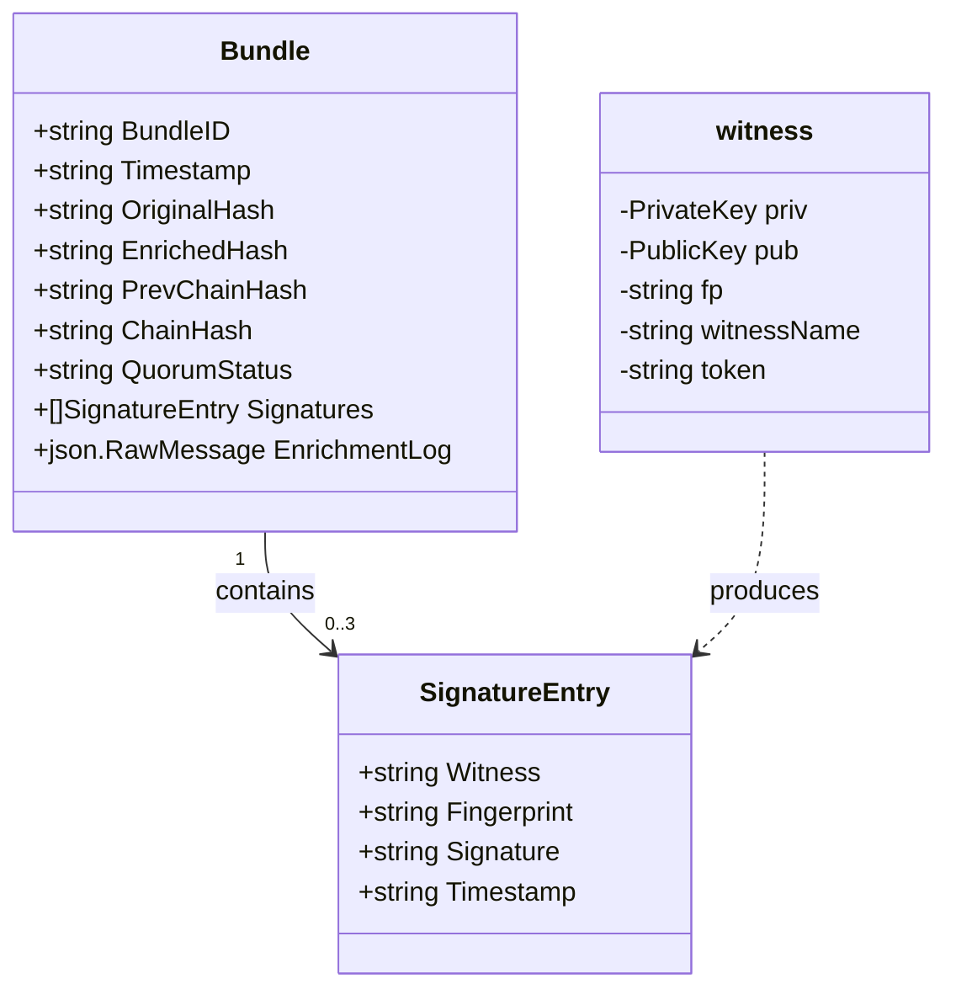

---

## 🔍 Real Code — `cmd/gateway/main.go` Lines 34–51

Here is how the real transaction forms are defined in the CONNEX gateway:

```go
// SignatureEntry — one witness's cryptographic signature form
type SignatureEntry struct {
    Witness     string `json:"witness"`      // Name: "alpha", "beta", or "gamma"
    Fingerprint string `json:"fingerprint"`  // Unique ID of the witness's key
    Signature   string `json:"signature"`    // The digital signature text (base64)
    Timestamp   string `json:"timestamp"`    // When the witness signed this
}

// Bundle — the complete transaction proof record form
type Bundle struct {
    BundleID      string          `json:"bundle_id"`
    Timestamp     string          `json:"timestamp"`
    OriginalHash  string          `json:"original_hash"`
    EnrichedHash  string          `json:"enriched_hash"`
    PrevChainHash string          `json:"prev_chain_hash"`
    ChainHash     string          `json:"chain_hash"`
    Signatures    []SignatureEntry `json:"signatures"`    // A LIST of signature forms
    QuorumStatus  string          `json:"quorum_status"`
    EnrichmentLog json.RawMessage `json:"enrichment_log"`
}
```

Let's dissect the components of a single struct field:

```
    BundleID          string          `json:"bundle_id"`
    ────────          ──────          ──────────────────
       │                │                     │
    Field name       Data type           Struct Tag:
    (Go code uses    (this field          When converting to
    this name)       holds text)          standard JSON text,
                                          call this "bundle_id"
```

---

## Public vs. Private (Capitalization is Power!)

Go has a simple but strict rule for visibility:

- **Public Fields (Capital Letter):** If a field name starts with a capital letter (like `Witness` or `BundleID`), it is exportable. Any other Go file or external toolbox (like the JSON parser) can see and modify this field.
- **Private Fields (Lowercase Letter):** If a field name starts with a lowercase letter (like `secretToken` or `priv`), it is private. It is locked inside its own folder, and outsiders are completely blocked from reading or editing it.

---

## Memory: The Stack vs. The Heap

When we fill out a struct form in Go, we can store it in two different parts of the computer's memory:

### 1. Fast Short-Term Memory: The Stack
If we create a struct like this:
```go
entry := SignatureEntry{Witness: "alpha"}
```
Go stores `entry` on the **Stack**. 
- The Stack is like a chef's immediate prep counter. It is incredibly fast.
- But as soon as the function finishing running, the entire prep counter is wiped clean. The data is thrown away.
- If we pass `entry` to another function, Go has to photocopy the entire form. If the form is huge, this is slow.

### 2. Spacious Long-Term Memory: The Heap
If we create a struct pointer using the `&` operator:
```go
entryPtr := &SignatureEntry{Witness: "alpha"}
```
Go stores the form on the **Heap**.
- The Heap is like a spacious storage pantry. Data remains safe here even after a function finishes running.
- `entryPtr` is a pointer card holding the address of that form in the pantry.
- If we pass `entryPtr` to another function, Go only copies the 8-byte address card, which is extremely fast.

---

## JSON Struct Tags: Translating Go to the Web

**JSON (JavaScript Object Notation)** is a simple, universal text format used to send data over the internet. A webpage or mobile app cannot read Go structs directly, but they can all read JSON text:
`{"bundle_id": "CX-1234", "quorum_status": "QUORUM_MET"}`

In Go, our struct fields must start with capital letters to be public (e.g. `BundleID`). But standard web pages expect lowercase fields (e.g. `"bundle_id"`).

We resolve this by adding **Struct Tags** in backticks (`` `json:"..."` ``) next to the fields:
```go
BundleID string `json:"bundle_id"`
```
This tells Go's built-in JSON translation toolbox: "When converting this struct to text (called **Marshalling**), write it as `"bundle_id"`. When reading JSON text back into a struct (called **Unmarshalling**), match `"bundle_id"` to `BundleID`."

---

## ✏️ Quiz 3A: Struct Pointers and Modification

Create a file named `sandbox/quiz3a.go`. Write a program that:
1. Defines a struct named `WitnessState` with two fields: `Name` (string) and `Active` (bool).
2. Write a function `deactivate(w *WitnessState)` that takes a **pointer** to `WitnessState` and changes its `Active` field to `false`.
3. In your `main()` function, instantiate a pointer to `WitnessState` (using the `&` operator) with name `"Beta"` and active status `true`.
4. Print the name and status before calling `deactivate`.
5. Call `deactivate`, passing your pointer.
6. Print the name and status again to verify the value changed in memory.

---

## ✅ Answer — Quiz 3A

```go
package main

import "fmt"

type WitnessState struct {
    Name   string
    Active bool
}

// Since w is a pointer (*), we are editing the original form in the pantry
func deactivate(w *WitnessState) {
    w.Active = false // Go automatically opens the drawer at address w
}

func main() {
    // Instantiate as a pointer using the & operator
    witness := &WitnessState{
        Name:   "Beta",
        Active: true,
    }

    fmt.Printf("Before: Name=%s, Active=%t\n", witness.Name, witness.Active)

    deactivate(witness) // Passes the address card to deactivate()

    fmt.Printf("After:  Name=%s, Active=%t\n", witness.Name, witness.Active)
}
```

**Expected Output:**
```
Before: Name=Beta, Active=true
After:  Name=Beta, Active=false
```

---

## ✏️ Quiz 3B: JSON Serialization & Deserialization

Create a file named `sandbox/quiz3b.go`. Write a program that:
1. Defines a struct `SystemConfig` with two public fields: `Port` (int) and `DBPath` (string), mapped to JSON tags `"port"` and `"db_path"`.
2. Adds a private field (lowercase) named `secretToken` (string) with no struct tag.
3. In `main()`, instantiate `SystemConfig` with a port of `8080`, database path `"data/connex.db"`, and token `"SUPER_SECRET"`.
4. Convert (Marshal) the struct to JSON text using the `json.Marshal(config)` function and print it. Observe if `secretToken` is visible in the text.
5. Take the JSON string `{"port":9000,"db_path":"/tmp/test.db"}` and parse (Unmarshal) it back into a new empty `SystemConfig` struct. Print the resulting struct fields.

---

## ✅ Answer — Quiz 3B

```go
package main

import (
    "encoding/json"
    "fmt"
)

type SystemConfig struct {
    Port        int    `json:"port"`
    DBPath      string `json:"db_path"`
    secretToken string // Lowercase! Private field.
}

func main() {
    config := SystemConfig{
        Port:        8080,
        DBPath:      "data/connex.db",
        secretToken: "SUPER_SECRET",
    }

    // 1. Convert struct to JSON text bytes
    jsonBytes, err := json.Marshal(config)
    if err != nil {
        fmt.Println("Error marshalling:", err)
        return
    }
    fmt.Println("JSON output:", string(jsonBytes))

    // 2. Convert JSON text back into a Go struct
    inputJSON := `{"port":9000,"db_path":"/tmp/test.db"}`
    var newConfig SystemConfig

    // We MUST pass a pointer (&newConfig) so json.Unmarshal can modify the fields!
    err = json.Unmarshal([]byte(inputJSON), &newConfig)
    if err != nil {
        fmt.Println("Error unmarshalling:", err)
        return
    }

    fmt.Printf("Parsed Struct: Port=%d, DBPath=%s, secretToken=%q\n",
        newConfig.Port, newConfig.DBPath, newConfig.secretToken)
}
```

**Expected Output:**
```
JSON output: {"port":8080,"db_path":"data/connex.db"}
Parsed Struct: Port=9000, DBPath=/tmp/test.db, secretToken=""
```

**Key Beginner Pitfalls Explained:**
- The private field `secretToken` is completely ignored during serialization and deserialization. Because it starts with a lowercase letter, the `json` package (which is outside our package) is blocked from accessing it.
- When calling `json.Unmarshal`, you must write `&newConfig`. If you forget the `&`, you are passing a copy of the empty struct, and the updates will be lost immediately!

---

## 🔄 Review Checkpoint 2

Answer from memory:
1. What is the difference between defining a struct vs instantiating it?
2. Why must struct fields start with a capital letter if we want to serialize them to JSON?
3. What is the difference between the Stack and the Heap memory in Go?
4. What do struct tags like `` `json:"port"` `` do?
5. Why does `json.Unmarshal` require a pointer argument (`&myStruct`)?

---


---

# Chapter 4: Functions & Scope — Reusable Recipes

---

## 📖 The Analogy: The Blender (Kitchen Appliance)

Imagine you want to make fruit smoothies every morning. 

Instead of building a motor, blades, and a container from scratch every single time, you buy a **Blender**.

```
              ┌─────────────────────────┐
  Inputs:     │ Strawberries + Milk     │  (Parameters)
              └────────────┬────────────┘
                           │
                           ▼
              ┌─────────────────────────┐
  Process:    │      [ BLENDER ]        │  (Function Body)
              └────────────┬────────────┘
                           │
                           ▼
              ┌─────────────────────────┐
  Outputs:    │    Strawberry Smoothie  │  (Return Values)
              └─────────────────────────┘
```

A **Function** is like that blender. It is a pre-built machine:
1. **Inputs (Parameters):** The raw ingredients you drop into the machine.
2. **Process:** The instructions inside the machine (enclosed in curly braces `{}`).
3. **Outputs (Return Values):** The finished product the machine hands back to you.

Once you write a function, you can press its button (call it) 10,000 times with different ingredients, and it will run the recipe perfectly every time.

---

## Function Anatomy — Visual Representation

Here is how a function is written in Go:

```
  func  sha256Hex  (data []byte)  (string, error)  {
  ────  ─────────  ────────────   ───────────────
   │       │            │                │
Keyword  Recipe Name  Input:           Outputs:
         (CamelCase)  a list of bytes  Returns text (string)
                      named "data"     AND an error
```

---

## Pass-by-Value vs. Pass-by-Pointer

How does Go pass variables into a function? Go is strictly a **pass-by-value** language. This means when you hand a variable to a function, Go makes a **photocopy** of the data and hands the copy to the function.

Let's explain this using the **Checkbook Analogy**:

### 1. Pass-by-Value (Handing over a Photocopy)
Suppose you have a check in your pocket for `150.50` (stored in a variable named `balance`).
```go
func doubleAmountValue(val float64) {
    val = val * 2
}
```
If you call `doubleAmountValue(balance)`:
1. Go reads your check, prints a photocopy of `150.50`, and hands the photocopy to `val`.
2. Inside the function, the photocopy is multiplied by 2, becoming `301.00`.
3. When the function ends, the photocopy is thrown in the trash.
4. Your original check in your pocket still says `150.50`! It was never changed.

### 2. Pass-by-Pointer (Handing over the Drawer Key)
Now we pass the memory address using the `*` operator:
```go
func doubleAmountPointer(val *float64) {
    *val = *val * 2
}
```
If you call `doubleAmountPointer(&balance)`:
1. You pass `&balance`—which is the cabinet key and drawer address of your original check.
2. Inside the function, `*val` dereferences the pointer. It uses the key to unlock the drawer, takes out the original check, and multiplies its value by 2.
3. Your original check is modified. It now says `301.00`!

---

## Understanding Variable Scope (Invisible Fences)

Where a variable is created determines who is allowed to see and use it. This is called **Scope**:

```
  ┌────────────────────────────────────────────────────────┐
  │ Package Scope (Declared outside functions)             │
  │ Visible to any file inside this folder.                │
  │ e.g. const CommissionRate = 0.02                       │
  │                                                        │
  │   ┌────────────────────────────────────────────────┐   │
  │   │ Local/Function Scope (Declared inside func)   │   │
  │   │ Only visible inside this function.             │   │
  │   │ Deleted as soon as the function ends.          │   │
  │   │                                                │   │
  │   │   ┌────────────────────────────────────────┐   │   │
  │   │   │ Block Scope (Declared inside if/for)   │   │   │
  │   │   │ Only visible inside this loop/block.   │   │   │
  │   │   └────────────────────────────────────────┘   │   │
  │   └────────────────────────────────────────────────┘   │
  └────────────────────────────────────────────────────────┘
```

---

## How Functions Call Each Other in CONNEX

In our bank gateway, a single request triggers a sequence of functions calling other functions, passing inputs and outputs down the line:

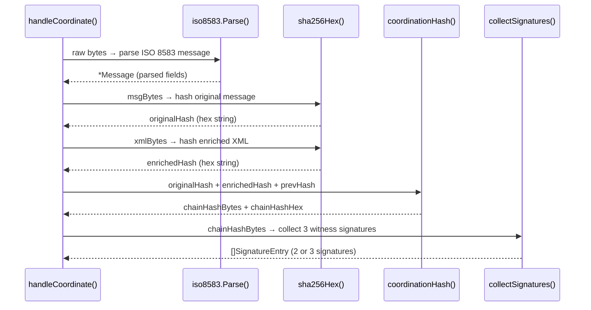

---

## 🔍 Real Code — Hashing Text — `cmd/gateway/main.go` Lines 125–128

Here is the real function used to hash transaction data:

```go
func sha256Hex(data []byte) string {
    h := sha256.Sum256(data)        // 1. Compute the secure hash. h is an array of 32 bytes
    return hex.EncodeToString(h[:]) // 2. Convert to slice, encode to hex text, and return
}
```

Let's dissect what happens inside:
- **`data []byte`**: The raw text bytes of the transaction.
- **`sha256.Sum256(data)`**: Computes the cryptographic checksum. If you change even one letter of the transaction, the resulting hash changes completely.
- **`h[:]`**: Converts the fixed-length 32-byte array `h` into a flexible slice `[]byte` because the hex package expects a slice.
- **`hex.EncodeToString(...)`**: Converts raw binary bytes into readable text string like `"d503ffab..."`.

---

## 🔍 Real Code — Multiple Return Values & The `_` Trash Can

Go functions can return multiple outputs at once. In banking, functions almost always return the desired data *and* an error object:

```go
func loadOrGenerate(keyPath string) (ed25519.PublicKey, ed25519.PrivateKey, error) {
    // ...
    return pub, priv, nil // Returns three items
}
```

When you call this function, you must receive all three:
```go
pub, priv, err := loadOrGenerate("keys/witness.key")
```

### What if you don't need one of the outputs?
In Go, if you declare a variable and don't use it, the compiler throws an error. If we only need the public key and the error, we use the **blank identifier `_` (the underscore)** to discard the private key:

```go
pub, _, err := loadOrGenerate("keys/witness.key")
//    ^-- Go throws the private key in the trash. No unused variable error!
```

---

## ❓ Ask Why?

- **Why does Go use multiple return values instead of exceptions (try/catch)?**
  *Answer:* Exceptions create hidden jumps in code execution, making it easy to miss errors. By forcing functions to return errors explicitly as values, Go makes it impossible for developers to ignore failures, which is crucial for secure bank ledgers!
- **Why pass pointers to functions for custom structs, but not for basic types like `int`?**
  *Answer:* Custom structs are large and expensive to copy in memory. Basic integers fit directly inside a CPU register, so copying them is faster than managing pointer dereferencing addresses.

---

## ✏️ Quiz 4A: Pass-by-Value vs. Pass-by-Pointer

Create a file named `sandbox/quiz4a.go`. Write a program that:
1. Defines a function `doubleAmountValue(val float64)` that multiplies `val` by 2 and prints it inside the function.
2. Defines a function `doubleAmountPointer(val *float64)` that multiplies the value stored at the address by 2 using the `*` operator.
3. In `main()`, set `balance := 150.50`.
4. Call `doubleAmountValue(balance)` and print the original `balance` value immediately after.
5. Call `doubleAmountPointer(&balance)` and print the original `balance` value immediately after.

---

## ✅ Answer — Quiz 4A

```go
package main

import "fmt"

func doubleAmountValue(val float64) {
    val = val * 2
    fmt.Printf("Inside doubleAmountValue: %.2f\n", val)
}

func doubleAmountPointer(val *float64) {
    *val = *val * 2 // Modify the original variable in the pantry
}

func main() {
    balance := 150.50

    fmt.Println("--- Pass-by-Value Test ---")
    doubleAmountValue(balance)
    fmt.Printf("Original balance afterwards: %.2f\n", balance)

    fmt.Println("\n--- Pass-by-Pointer Test ---")
    doubleAmountPointer(&balance) // Pass the memory address
    fmt.Printf("Original balance afterwards: %.2f\n", balance)
}
```

**Expected Output:**
```
--- Pass-by-Value Test ---
Inside doubleAmountValue: 301.00
Original balance afterwards: 150.50

--- Pass-by-Pointer Test ---
Original balance afterwards: 301.00
```

---

## ✏️ Quiz 4B: Multiple Returns & Scope

Create a file named `sandbox/quiz4b.go`. Write a program that:
1. Declares a package-level constant named `CommissionRate = 0.02` (2%).
2. Defines a function `calculateFee(amount float64) (float64, float64)` that returns:
   - The commission fee (`amount * CommissionRate`)
   - The final net amount (`amount - fee`)
3. In `main()`, set `txAmount := 50000.00`.
4. Receive the fee and net amount using multiple return values, print them, and verify that variables declared inside `calculateFee` cannot be accessed inside `main()`.

---

## ✅ Answer — Quiz 4B

```go
package main

import "fmt"

// Package scope: visible to all functions in this file
const CommissionRate = 0.02

func calculateFee(amount float64) (float64, float64) {
    fee := amount * CommissionRate // Local function scope
    net := amount - fee            // Local function scope
    return fee, net
}

func main() {
    txAmount := 50000.00

    // Receive the multiple return values
    fee, net := calculateFee(txAmount)

    fmt.Printf("Transaction Amount: KES %.2f\n", txAmount)
    fmt.Printf("Commission Fee (2%%): KES %.2f\n", fee)
    fmt.Printf("Net Amount Received: KES %.2f\n", net)

    // Note: If you try to print "fee" variable declared inside calculateFee() here,
    // the code will fail to compile. It is locked inside calculateFee()'s fence.
}
```

**Expected Output:**
```
Transaction Amount: KES 50000.00
Commission Fee (2%): KES 1000.00
Net Amount Received: KES 49000.00
```

---

## 🔄 Review Checkpoint 2

Answer from memory:
1. What does it mean that Go is "pass-by-value"?
2. How do you pass a variable by pointer to a function?
3. What is package scope vs local function scope?
4. Write a function signature that accepts a slice of bytes and returns a string and an error.
5. What does the `_` character do when calling functions that return multiple values?

---

---

# Chapter 5: Methods — Functions That Belong to a Struct

---

## 📖 The Analogy: Specialized Buttons on a Microwave

In the kitchen, a blender is a standalone machine. You drop ingredients into it and it runs. That is like a standard function: `sha256Hex(data)`.

Now, think of a **Microwave**. A microwave has specialized buttons built right onto its control panel, such as a **"Popcorn"** button or a **"Defrost"** button.

```
  Standalone Function:             Method on a Struct:
  ───────────────────              ───────────────────
  Defrost(myMicrowave, beef)       myMicrowave.Defrost(beef)
  │                                │
  You pass the microwave in        The method belongs to the
  as a parameter.                  microwave struct. It has direct
                                   access to its own timer & power.
```

In programming, a **Method** is a function that is bound directly to a specific struct (form). 
- Instead of passing the form as a parameter, the method is attached to the form.
- You call the method by writing `structInstance.MethodName()`.
- The method automatically has access to all the fields inside that struct.

---

## Receiver Syntax: Binding a Method to a Struct

To turn a regular function into a method, we place a special parameter in front of the method name. This is called the **Receiver**:

```go
func (w *witness) handlePubkey(rw http.ResponseWriter, r *http.Request) {
//    ^─────────
//    The Receiver: w is a pointer to the witness struct.
//    Inside this function, "w" refers to this specific witness in memory.
}
```

---

## Value Receivers vs. Pointer Receivers

Go methods can be defined with either a copy of the struct (Value Receiver) or the address of the struct (Pointer Receiver):

### 1. Value Receiver: `func (w witness) Method()`
- Go makes a **photocopy** of the struct and hands it to the method.
- The method can read the fields, but if it modifies them, the original struct remains unchanged.
- Think of it as a **"Read-Only"** status display button on a microwave.

### 2. Pointer Receiver: `func (w *witness) Method()`
- Go hands the **memory address (drawer key)** of the struct to the method.
- The method can modify the original struct's fields directly.
- Think of it as a **"Read-Write"** dial that changes the microwave's cooking timer.

### Go's Syntactic Sugar (Automatic Dereferencing)
In other languages, if you have a pointer to a struct, you must write `(*w).witnessName` to access its field. In Go, you can simply write `w.witnessName`. The Go compiler is smart enough to open the drawer for you automatically under the hood!

Furthermore, if you call a method expecting a pointer receiver (like `w.Deposit()`) on a value variable, Go automatically converts it to `(&w).Deposit()` for you.

---

## HTTP Request Flow Through a Method

In the CONNEX witness node, the HTTP server uses methods to handle web requests. By binding methods to the `witness` struct, the handlers can easily access the loaded cryptographic private key fields stored in memory:

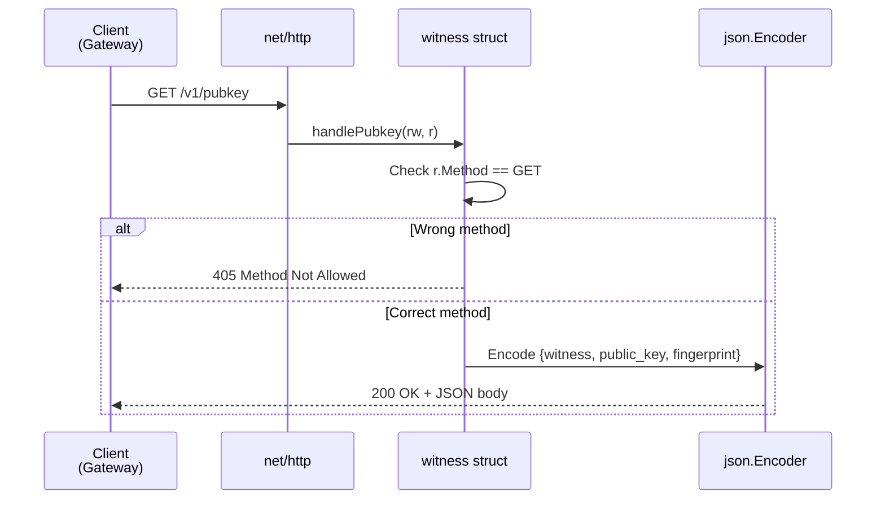

---

## 🔍 Real Code — `cmd/witness/main.go` Lines 82–93

Here is the real method that serves the witness public key over the web:

```go
func (w *witness) handlePubkey(rw http.ResponseWriter, r *http.Request) {
    // 1. Enforce that only GET requests are allowed
    if r.Method != http.MethodGet {
        http.Error(rw, "GET required", http.StatusMethodNotAllowed)
        return // Stop immediately
    }

    // 2. Set the HTTP response header to JSON format
    rw.Header().Set("Content-Type", "application/json")

    // 3. Write JSON response using our witness's internal fields (w.witnessName, etc.)
    json.NewEncoder(rw).Encode(map[string]string{
        "witness":     w.witnessName,
        "public_key":  base64.StdEncoding.EncodeToString(w.pub),
        "fingerprint": w.fp,
    })
}
```

---

## 🔍 Real Code — Currency Conversion — `internal/iso8583/parser.go` Lines 91–101

Here is the real method that reads the raw ATM cents from a bank message and converts it to standard currency units:

```go
func (m *Message) AmountKES() float64 {
	s, ok := m.Fields[4] // Look up field 4 in our message fields map
	if !ok || s == "" {  // If field 4 isn't found or is empty...
		return 0         // ...amount is zero KES
	}
	n, err := strconv.ParseInt(strings.TrimLeft(s, "0 "), 10, 64)
	if err != nil {
		return 0
	}
	return float64(n) / 100.0 // Divide cents by 100 to get KES
}
```

Let's trace how the number `"000000100000"` is decoded:
```
  ATM raw field value:  "000000100000"
  strings.TrimLeft:     "100000"        (strips leading zeros)
  strconv.ParseInt:     100000          (parses as raw integer cents)
  float64(n) / 100.0:   1000.00         (KES)
```

---

## ❓ Ask Why?

- **Why declare `AmountKES` on `*Message` (pointer) if it doesn't change any fields (read-only)?**
  *Answer:* Efficiency! A `Message` struct contains a large map of transaction fields. If we used a value receiver `(m Message)`, Go would copy the entire map every time we called the method. Using a pointer receiver passes only an 8-byte address.
- **Why can we write `w.witnessName` instead of `(*w).witnessName`?**
  *Answer:* Go's compiler was designed to eliminate tedious typing. It automatically dereferences pointer fields when accessing them.

---

## ✏️ Quiz 5A: Value Receiver (Read-Only)

Create a file named `sandbox/quiz5a.go`. Write a program that:
1. Defines a struct `FeeCalculator` with fields: `FixedFee` (float64) and `PercentageFee` (float64).
2. Adds a method `Calculate(amount float64) float64` with a **Value Receiver** (`f FeeCalculator`) that returns `FixedFee + (amount * PercentageFee)`.
3. In `main()`, instantiate `FeeCalculator` with fixed fee `50.00` and percentage fee `0.01` (1%).
4. Call `Calculate` for a transaction of `10000.00` and print the resulting total fee.

---

## ✅ Answer — Quiz 5A

```go
package main

import "fmt"

type FeeCalculator struct {
    FixedFee      float64
    PercentageFee float64
}

// Value receiver: f is a local copy, read-only
func (f FeeCalculator) Calculate(amount float64) float64 {
    return f.FixedFee + (amount * f.PercentageFee)
}

func main() {
    calc := FeeCalculator{
        FixedFee:      50.00,
        PercentageFee: 0.01,
    }

    fee := calc.Calculate(10000.00)
    fmt.Printf("Total Fee: KES %.2f\n", fee)
}
```

**Expected Output:**
```
Total Fee: KES 150.00
```

---

## ✏️ Quiz 5B: Pointer Receiver (Mutating State)

Create a file named `sandbox/quiz5b.go`. Write a program that:
1. Defines a struct `BankAccount` with fields `AccountHolder` (string) and `Balance` (float64).
2. Adds a method `Deposit(amount float64)` with a **Pointer Receiver** (`a *BankAccount`) that adds `amount` to the account `Balance`.
3. Adds a method `Withdraw(amount float64) bool` with a **Pointer Receiver** (`a *BankAccount`) that deducts `amount` from `Balance` if funds are sufficient (returning `true`). If funds are insufficient, make no changes and return `false`.
4. In `main()`, create a pointer to `BankAccount` for `"John Doe"` with initial balance `500.00`.
5. Deposit `1000.00`, withdraw `300.00`, and withdraw `2000.00`. Print the balance after each step.

---

## ✅ Answer — Quiz 5B

```go
package main

import "fmt"

type BankAccount struct {
    AccountHolder string
    Balance       float64
}

// Pointer receiver: modifies the actual balance in the pantry
func (a *BankAccount) Deposit(amount float64) {
    a.Balance += amount
}

// Pointer receiver: modifies the balance and returns success/failure status
func (a *BankAccount) Withdraw(amount float64) bool {
    if a.Balance < amount {
        return false // Insufficient funds!
    }
    a.Balance -= amount
    return true
}

func main() {
    acc := &BankAccount{
        AccountHolder: "John Doe",
        Balance:       500.00,
    }

    fmt.Printf("Initial Balance: KES %.2f\n", acc.Balance)

    acc.Deposit(1000.00)
    fmt.Printf("After Deposit:   KES %.2f\n", acc.Balance)

    if acc.Withdraw(300.00) {
        fmt.Println("Withdrawal of 300.00 successful ✓")
    } else {
        fmt.Println("Withdrawal of 300.00 failed ❌")
    }
    fmt.Printf("Balance:         KES %.2f\n", acc.Balance)

    if acc.Withdraw(2000.00) {
        fmt.Println("Withdrawal of 2000.00 successful ✓")
    } else {
        fmt.Println("Withdrawal of 2000.00 failed ❌ (Insufficient Funds)")
    }
    fmt.Printf("Final Balance:   KES %.2f\n", acc.Balance)
}
```

**Expected Output:**
```
Initial Balance: KES 500.00
After Deposit:   KES 1500.00
Withdrawal of 300.00 successful ✓
Balance:         KES 1200.00
Withdrawal of 2000.00 failed ❌ (Insufficient Funds)
Final Balance:   KES 1200.00
```

**Beginner Pitfall to Remember:**
If you had declared `Deposit` as `func (a BankAccount) Deposit(...)` (without the `*`), Go would pass a copy. The balance inside the method would increase, but the original balance in `main()` would stay `500.00`. Always use pointer receivers when mutating struct fields!

---

# Chapter 6: Error Handling — Never Let Problems Go Silent

---

## 📖 The Analogy: The Payment Terminal Traffic Light

Imagine you swipe your credit card at a coffee shop payment terminal:
- **Green Light:** The transaction goes through successfully.
- **Red Light:** The screen displays: "Insufficient Funds" or "Incorrect PIN".

If the payment terminal went completely blank and silent, you would have no idea what went wrong. Did your bank account run out of money? Did the internet connection drop? Did the card reader break?

```
  Automatic Crash (Other languages):   Go's Explicit Return:
  ─────────────────────────────────   ──────────────────────
  The program crashes instantly.       The function completes and returns
  All processing stops.                a result AND a traffic light value:
                                       - Green (nil) = Success
                                       - Red (error) = This went wrong
```

In banking, **silence is a massive risk**. We must always know exactly if and why a step failed. 

Go does not use automatic crashes (called "exceptions"). Instead, Go treats errors as **ordinary values** that functions return. You must inspect these values manually after every step.

---

## The built-in `error` Interface

An **Interface** in Go is like a **contract or specification sheet**. 

The language defines a built-in contract named `error`:

```go
type error interface {
    Error() string
}
```

This contract says: "Any struct form in Go can be used as an error, as long as it has a method named `Error()` that returns a text string explaining what went wrong."

When a function executes successfully, it returns **`nil`** (which means "nothing" or "empty" in Go) for its error parameter. If something goes wrong, it returns a real error object.

---

## The Error Handling Pattern — Visual

After calling any function that can fail, we write a condition to check if the error is **not empty** (`err != nil`):

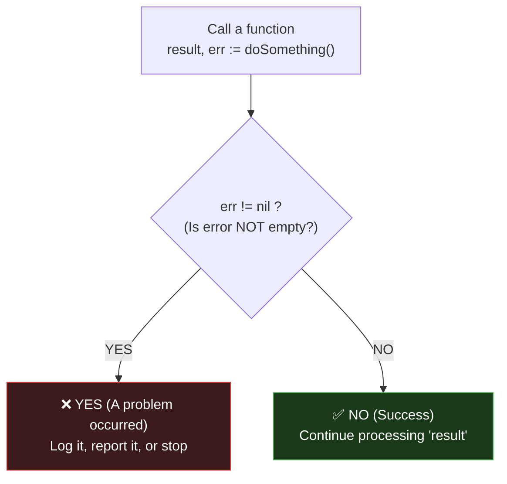

---

## Error Wrapping: Russian Nesting Dolls

If a database write fails deep inside the system because of a "Permission Denied" disk error, passing that raw message directly to the bank customer isn't helpful.

We want to add context (e.g., *"Cannot process payment: [Permission Denied]"*).

In Go, we do this by **Error Wrapping** using a special formatting verb `%w`:

```go
return fmt.Errorf("cannot process payment: %w", err)
```

The `%w` acts like a pocket that wraps the original error inside our new error, like nested **Russian dolls**:

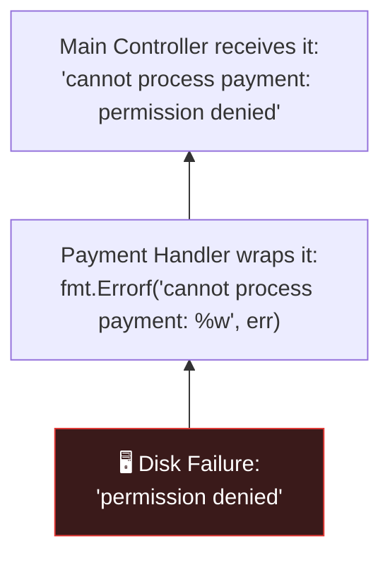

By wrapping errors, we keep track of the entire chain of events.

### Opening the Nesting Dolls: `errors.Is` and `errors.As`
Because errors are wrapped inside other errors, you cannot do a simple equality check like `err == ErrNoRows`. Go provides two functions to search inside the error chain:

1. **`errors.Is(err, target)`:** Traverses the chain (opens all the nesting dolls) to see if any error in the chain matches the `target` sentinel error.
   ```go
   if errors.Is(err, sql.ErrNoRows) { // handle empty database case }
   ```
2. **`errors.As(err, &targetStruct)`:** Checks if any error in the chain is a specific custom struct error form (like `FundError`) and extracts its fields so you can read them.

---

## 🔍 Real Code — Secure File Writes — `cmd/witness/main.go` Lines 47–63

Here is how the witness node generates cryptographic key files on disk and handles file errors:

```go
pub, priv, err := ed25519.GenerateKey(rand.Reader)
if err != nil {
    // 1. Wrap the error with context and return it
    return nil, nil, fmt.Errorf("generate keypair: %w", err)
}

// 2. Write private key using permission code 0600 (owner read/write only)
if err := os.WriteFile(privPath, priv, 0600); err != nil {
    return nil, nil, fmt.Errorf("write private key: %w", err)
}

// 3. Write public key using permission code 0644 (everyone can read)
if err := os.WriteFile(pubPath, pub, 0644); err != nil {
    return nil, nil, fmt.Errorf("write public key: %w", err)
}
```

### POSIX File Permissions Explained:
- **`0600` (Secret Key):** Only the owner of the process can read and write this file. Security-critical private keys must use this so other users on the server cannot steal them!
- **`0644` (Public Key):** The owner can read/write, and everyone else can read. Public keys are meant to be shared, so this enables others to verify signatures.

---

## ❓ Ask Why?

- **Why does Go force manual checking of errors instead of automatic exception handling?**
  *Answer:* Exceptions create hidden jumps in code execution, which makes it easy for developers to miss failure cases. Manual checks make every possible failure point visible in the source code, reducing critical bugs.
- **Why must we use `errors.Is(err, target)` instead of `err == target`?**
  *Answer:* If an error was wrapped (e.g. `fmt.Errorf("context: %w", err)`), it is a new error value. A direct `==` check will fail. `errors.Is` opens the wrapped boxes to look for the core issue.

---

## ✏️ Quiz 6A: Error Wrapping and Propagation

Create a file named `sandbox/quiz6a.go`. Write a program that:
1. Defines a function `checkDatabaseConnection() error` that returns a raw error: `errors.New("connection timeout")`.
2. Defines a function `initializeLedger() error` that calls `checkDatabaseConnection()`. If it returns an error, wrap it: `fmt.Errorf("initialize ledger: %w", err)`.
3. In `main()`, call `initializeLedger()`. If it returns an error, print the full chain message and print the unwrapped root error using `errors.Unwrap(err)`.

---

## ✅ Answer — Quiz 6A

```go
package main

import (
    "errors"
    "fmt"
)

func checkDatabaseConnection() error {
    return errors.New("connection timeout")
}

func initializeLedger() error {
    err := checkDatabaseConnection()
    if err != nil {
        // Wrap the error with context using %w
        return fmt.Errorf("initialize ledger: %w", err)
    }
    return nil
}

func main() {
    err := initializeLedger()
    if err != nil {
        fmt.Println("Full Error Chain:", err)
        
        // Unwrap opens the outermost doll to reveal the root error
        rootErr := errors.Unwrap(err)
        fmt.Println("Root Cause:", rootErr)
        return
    }
    fmt.Println("Ledger initialized successfully!")
}
```

**Expected Output:**
```
Full Error Chain: initialize ledger: connection timeout
Root Cause: connection timeout
```

---

## ✏️ Quiz 6B: Custom Errors & `errors.Is` / `errors.As`

Create a file named `sandbox/quiz6b.go`. Write a program that:
1. Defines a custom struct error `FundError` with fields `Required` (float64) and `Available` (float64). It must implement the `Error() string` method returning `"insufficient funds: need KES X, only have KES Y"`.
2. Defines a package constant `ErrSystemMaintenance = errors.New("system undergoing maintenance")`.
3. Write a function `processPayment(amount float64, balance float64, maintenance bool) error`:
   - If `maintenance` is `true`, return `ErrSystemMaintenance`.
   - If `amount > balance`, return an instance of `*FundError`.
   - Otherwise, return `nil`.
4. In `main()`, call `processPayment(1000.00, 500.00, false)`. Check if it is a `*FundError` using `errors.As` and print the fields.
5. In `main()`, call `processPayment(100.00, 500.00, true)`. Check if it matches `ErrSystemMaintenance` using `errors.Is` and print `"Retry transaction later"`.

---

## ✅ Answer — Quiz 6B

```go
package main

import (
    "errors"
    "fmt"
)

// Custom error struct
type FundError struct {
    Required  float64
    Available float64
}

// Implement the error interface contract
func (e *FundError) Error() string {
    return fmt.Sprintf("insufficient funds: need KES %.2f, only have KES %.2f", e.Required, e.Available)
}

// Standard sentinel error
var ErrSystemMaintenance = errors.New("system undergoing maintenance")

func processPayment(amount float64, balance float64, maintenance bool) error {
    if maintenance {
        return ErrSystemMaintenance
    }
    if amount > balance {
        return &FundError{Required: amount, Available: balance}
    }
    return nil
}

func main() {
    // Test Case 1: Insufficient funds
    fmt.Println("--- Test Case 1 ---")
    err1 := processPayment(1000.00, 500.00, false)
    if err1 != nil {
        var fundErr *FundError
        // errors.As checks if err1 contains a *FundError and extracts it
        if errors.As(err1, &fundErr) {
            fmt.Println("Fund Error caught!")
            fmt.Printf("Required: KES %.2f, Available: KES %.2f\n", fundErr.Required, fundErr.Available)
        } else {
            fmt.Println("Other error:", err1)
        }
    }

    // Test Case 2: System maintenance
    fmt.Println("\n--- Test Case 2 ---")
    err2 := processPayment(100.00, 500.00, true)
    if err2 != nil {
        // errors.Is checks if err2 is ErrSystemMaintenance
        if errors.Is(err2, ErrSystemMaintenance) {
            fmt.Println("Error: System is currently down for maintenance.")
            fmt.Println("Action: Retry transaction later.")
        } else {
            fmt.Println("Other error:", err2)
        }
    }
}
```

**Expected Output:**
```
--- Test Case 1 ---
Fund Error caught!
Required: KES 1000.00, Available: KES 500.00

--- Test Case 2 ---
Error: System is currently down for maintenance.
Action: Retry transaction later.
```

---

## 🔄 Review Checkpoint 3

Answer from memory:
1. What is the built-in `error` interface definition in Go?
2. What formatting verb do you use to wrap an error inside another?
3. What is the difference between `errors.Is` and `errors.As`?
4. Why does a custom error struct implementation usually use a pointer receiver for its `Error()` method?
5. Write the syntax to unwrap a wrapped error value `err`.

---
---

---

# Chapter 7: Goroutines & Channels — Running Code Simultaneously

---

## 📖 The Analogy: Background Assistants & Pneumatic Message Tubes

Imagine you are running a bank branch, and you need authorization signatures from 3 different managers (Alpha, Beta, and Gamma) to approve a large loan:

### 1. The Slow Way (Sequential)
You walk to Alpha's office and wait for him to sign. Then you walk to Beta's office and wait. Finally, you walk to Gamma's office and wait. 
- Total time: **150ms** (each takes 50ms).

### 2. The Smart Way (Parallel with Goroutines)
You hire 3 background assistants (**Goroutines**). You hand a copy of the contract to each assistant and say: "Go get this signed." All 3 assistants run off at the same time.
- Total time: **~50ms** (the managers work simultaneously).

```
  Sequential (150ms total):
  Walk to Alpha (wait) ──► Walk to Beta (wait) ──► Walk to Gamma (wait)

  Parallel (50ms total):
  Assistant 1 ──► Ask Alpha  ──────┐
  Assistant 2 ──► Ask Beta   ──────┼──► (All sign at the same time)
  Assistant 3 ──► Ask Gamma  ──────┘
```

### 3. Communicating back (Channels)
How do the assistants send the signed papers back to your desk? You install **pneumatic message tubes (Channels)** between their desks and yours.
- When an assistant gets a signature, they slip the tube capsule in: `ch <- signature` (Send).
- You sit at your desk and catch the capsules as they arrive: `sig := <-ch` (Receive).

---

## Concurrency vs. Parallelism (Tellers in a Bank)

- **Concurrency (Multitasking):** A single bank teller serving one line of customers. If a customer needs to search their bag for an ID, the teller pauses and serves the next customer. The teller is managing multiple tasks, but only executing one at any microsecond.
- **Parallelism (Simultaneous execution):** Three bank tellers serving three customers at the same time at separate counters. This requires multiple processors (multi-core CPUs).

In Go, we launch a background task by typing the keyword **`go`** in front of a function call. This starts a **Goroutine**—a lightweight background assistant managed automatically by the Go compiler.

---

## Channels: Safe Communication

In programming, if two background tasks try to modify the same variable at the same instant, the program gets corrupted (called a **Race Condition**). Go prevents this by using Channels: **"Do not communicate by sharing memory; share memory by communicating."**

```go
ch := make(chan int) // Creates a pneumatic tube that only carries whole numbers

ch <- 42    // Pushes the number 42 into the tube (Send)
val := <-ch // Catches the number from the tube and saves it in val (Receive)
```

### Unbuffered vs. Buffered Channels
1. **Unbuffered Channels (Default):**
   `ch := make(chan string)`
   The tube has no storage box at the end. The sender cannot drop the capsule in unless the receiver is already standing at the other end with their hand open to catch it. If either side arrives early, they freeze and wait (**block**) for the other.
2. **Buffered Channels:**
   `ch := make(chan string, 3)`
   The tube drops capsules into a small mailbox container of size `3`. The sender can drop up to 3 capsules in and walk away immediately, even if the receiver is asleep. Once the mailbox is full, any further sends will block until the receiver takes some out.

---

## The `select` Statement & Timeouts

What if one of the managers falls asleep and never signs? Your assistants will wait forever, and the loan will freeze.

The **`select`** statement lets you monitor multiple tubes at the same time. You also place a physical **egg timer** on your desk (`time.After`):

```go
select {
case msg := <-ch:
    fmt.Println("Received signed document:", msg)
case <-time.After(100 * time.Millisecond):
    fmt.Println("⏰ Timer rang! Loan rejected due to timeout.")
}
```

Whichever case happens first is executed. If the timer rings before any manager signs, we stop waiting and reject the transaction. This keeps our bank server running fast.

---

## Sequential vs. Parallel — Timeline

This timeline shows the difference in transaction execution speed:

```mermaid
gantt
    title Transaction Signing: Sequential vs Parallel
    dateFormat X
    axisFormat %Lms

    section Sequential (150ms total)
    Ask Witness Alpha  :crit, s1, 0, 50
    Ask Witness Beta   :crit, s2, 50, 100
    Ask Witness Gamma  :crit, s3, 100, 150

    section Parallel with Goroutines (~50ms total)
    Ask Witness Alpha  :active, p1, 0, 50
    Ask Witness Beta   :active, p2, 0, 50
    Ask Witness Gamma  :active, p3, 0, 50
```

---

## Goroutines + Channels — How They Communicate

```
  GOROUTINE (Assistant)             MAIN CODE (You)
  ─────────────────────             ───────────────
  Does work in background           Waits for results at desk
                │                         │
                │  ch <- result{sig, err} │
                └──────────────────────►  │  r := <-ch
                      the CHANNEL         │  (receive result)
                      (the tube)
```

---

## 🔍 Real Code — Signature Collection — `cmd/gateway/main.go` Lines 87–121

Here is the real Gateway function that collects signatures from witnesses in parallel:

```go
func collectSignatures(witnesses []string, tokens []string, hashBytes []byte, timeout time.Duration) []SignatureEntry {
	type result struct {
		sig *SignatureEntry
		err error
	}
    // 1. Create a buffered channel mailbox of size 3
	ch := make(chan result, len(witnesses))

	for i, w := range witnesses {
		w := w // <-- Local variable capture (photocopy w)
		var token string
		if i < len(tokens) {
			token = tokens[i]
		}
        // 2. Launch background goroutine assistant
		go func() {
			sig, err := requestSignature(w, token, hashBytes, timeout)
			ch <- result{sig, err} // Push results into mailbox
		}()
	}

	var sigs []SignatureEntry
	deadline := time.After(timeout) // 3. Set the egg timer

    // 4. Loop 3 times (once for each witness) to check the mailbox
	for range witnesses {
		select {
		case r := <-ch: // Capsule arrived in mailbox!
			if r.err != nil {
				slog.Warn("witness error", "err", r.err)
			} else {
				sigs = append(sigs, *r.sig) // Add signature to list
			}
		case <-deadline: // Egg timer rang!
			slog.Warn("witness timeout reached", "collected", len(sigs))
			return sigs // Return what we have gathered so far
		}
	}
	return sigs
}
```

### Why do we write `w := w` inside the loop?
In Go, loop variables are updated in place. If we launched 3 goroutines without `w := w`, they would all point to the same shared loop drawer. By the time the background assistants started running, the drawer would contain the final witness `"gamma"`. All 3 assistants would call Gamma! 

Writing `w := w` creates a local photocopy of the name for each assistant, ensuring they call Alpha, Beta, and Gamma respectively.

---

## How Quorum Works — The Select Loop

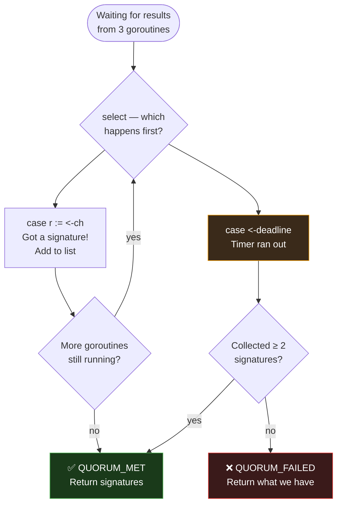

---

## ❓ Ask Why?

- **Why buffer the result channel `ch := make(chan result, 3)` instead of keeping it unbuffered?**
  *Answer:* If the gateway times out and exits, it stops reading from the channel. If the channel is unbuffered, the background goroutines will block forever when trying to send their signatures. They will be frozen in memory, causing a memory leak! A buffer lets them leave their capsules in the mailbox and exit cleanly.
- **Why does Go warn us that launching a goroutine without local variable capture is a security hazard?**
  *Answer:* If assistants share the same loop variable, they will fetch signatures from the wrong witness nodes, violating bank consensus!

---

## ✏️ Quiz 7A: Buffered Channels and Goroutines

Create a file named `sandbox/quiz7a.go`. Write a program that:
1. Creates a buffered channel of strings named `jobs` with capacity `3`.
2. Launches a background worker goroutine that reads 3 strings from the channel, printing `"Processing: " + job` for each, sleeping `100ms` between them.
3. In `main()`, push three strings into the channel: `"Verify MTI"`, `"Validate Bitmap"`, and `"Hash Transaction"`.
4. Sleep for `500ms` at the end of `main()` to give the worker time to finish.

---

## ✅ Answer — Quiz 7A

```go
package main

import (
    "fmt"
    "time"
)

func worker(jobs chan string) {
    for i := 0; i < 3; i++ {
        job := <-jobs // Receives a job capsule from the tube
        fmt.Println("Processing:", job)
        time.Sleep(100 * time.Millisecond)
    }
}

func main() {
    jobs := make(chan string, 3) // Buffered mailbox

    // Launch worker in background
    go worker(jobs)

    // Push 3 items into the mailbox (does not block because cap is 3)
    jobs <- "Verify MTI"
    jobs <- "Validate Bitmap"
    jobs <- "Hash Transaction"

    fmt.Println("All jobs queued!")

    // Keep main running so the program doesn't close before the worker finishes
    time.Sleep(500 * time.Millisecond)
}
```

**Expected Output:**
```
All jobs queued!
Processing: Verify MTI
Processing: Validate Bitmap
Processing: Hash Transaction
```

---

## ✏️ Quiz 7B: Select Statement & Timeouts

Create a file named `sandbox/quiz7b.go`. Write a program that:
1. Creates an unbuffered channel of strings `response`.
2. Launches a goroutine simulating a witness that sleeps for `2` seconds and then sends `"Alpha Approved ✓"` to `response`.
3. In `main()`, use a `select` statement to wait on the channel:
   - If a message arrives, print it.
   - If `1` second passes (using `time.After(1 * time.Second)`), print `"⏰ Timeout reached! Payment rejected."` and exit.
4. Modify the timeout to `3` seconds and run again to see the success path.

---

## ✅ Answer — Quiz 7B

```go
package main

import (
    "fmt"
    "time"
)

func simulateWitness(ch chan string) {
    time.Sleep(2 * time.Second) // Simulate slow network call
    ch <- "Alpha Approved ✓"
}

func main() {
    response := make(chan string)

    go simulateWitness(response)

    // Test Case 1: Timeout is shorter than network call
    fmt.Println("--- Running with 1-second timeout ---")
    select {
    case msg := <-response:
        fmt.Println("Received:", msg)
    case <-time.After(1 * time.Second):
        fmt.Println("⏰ Timeout reached! Payment rejected.")
    }

    // Test Case 2: Timeout is longer than network call
    response2 := make(chan string)
    go simulateWitness(response2)

    fmt.Println("\n--- Running with 3-second timeout ---")
    select {
    case msg := <-response2:
        fmt.Println("Received:", msg)
    case <-time.After(3 * time.Second):
        fmt.Println("⏰ Timeout reached! Payment rejected.")
    }
}
```

**Expected Output:**
```
--- Running with 1-second timeout ---
⏰ Timeout reached! Payment rejected.

--- Running with 3-second timeout ---
Received: Alpha Approved ✓
```

---

## 🔄 Review Checkpoint 4 — Interleaved (All Chapters Mixed)

Answer these questions from memory:
1. **(Ch.1)** What happens if you import a package but never use it?
2. **(Ch.2)** What is the difference between a `string` and a `[]byte`?
3. **(Ch.3)** How do public fields differ from private fields in structs?
4. **(Ch.4)** Write a function signature that takes a slice of bytes and returns a string and an error.
5. **(Ch.5)** In `func (m *Message) AmountKES() float64`, what does `*` mean?
6. **(Ch.6)** How does `%w` differ from `%v` when formatting errors?
7. **(Ch.7)** What is a channel, and how do send `<-` and receive `<-` operations work?

---
---

---

# Chapter 8: The Full Picture — Code Walkthroughs

---

## Every Step a Bank Transaction Takes in CONNEX

To visualize the system, we use a **Sequence Diagram**. If you've never seen one before, think of it as a timeline that reads from top to bottom.
- Each vertical column represents a different **actor** or **component** in our system (like the Gateway, the Parser, or the Database).
- The horizontal arrows represent **messages** or **data packets** sent from one actor to another.

Let's look at the diagram first, and then we will walk through each step in plain English:

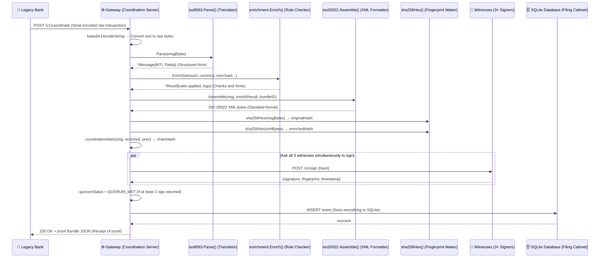

### Explaining the Timeline in Plain English
1. **The Request**: A legacy bank server sends a transaction to our **Gateway** (the coordinator program) using a web request. The transaction is encoded in a format called `base64` (a way to write raw binary data using readable letters).
2. **Translation**: The Gateway translates the text back into raw binary bytes, then hands it to the **Parser**. The Parser reads the binary message and turns it into a Go **Struct** (like filling out a clean paper form).
3. **Checking & Rules**: The Gateway sends the transaction details to the **Enrichment Engine**, which checks limits (e.g., "Is this amount over KES 100,000?") and adds necessary metadata.
4. **Standardization**: The Gateway takes the parsed data and outputs a standardized, modern bank message in **XML** format.
5. **Fingerprinting (Hashing)**: The Gateway calculates a unique digital fingerprint (called a **Hash**) of the original message and the new XML message. It links them with the hash of the *previous* transaction, forming an unbroken chain (like a paper chain where each loop connects to the one before it).
6. **Witness Notarization**: The Gateway sends this chain fingerprint to 3 independent **Witness servers** at the same time. Each witness verifies the data and signs it using a cryptographic key (like a notary seal).
7. **Writing to SQLite**: If at least 2 out of the 3 witnesses sign (called a **Quorum**), the Gateway writes the complete transaction and its signatures into a **SQLite Database** (the permanent storage cabinet).
8. **The Response**: Finally, the Gateway sends a success message and receipt back to the bank.

---

## Walkthrough 1: Parsing Raw Bytes (`internal/iso8583/parser.go`)

In bank communication, computers send data as a stream of raw bytes. Let's look at the core parser logic that reads the **ISO 8583 bitmap** and dynamic fields.

### 1. The Bitmap Field Decoder (`bitmapBits`)
What is a **Bitmap**? Imagine a sheet of paper with 64 numbered check boxes. Instead of writing out the name of every field we are sending, we just check the boxes. In computer memory, this sheet of paper is represented by **8 bytes** (since 1 byte has 8 bits, 8 bytes × 8 bits = 64 checkboxes). A bit that is `1` means the checkbox is checked; a `0` means it is unchecked.

Here is the Go function that decodes this:

```go
func bitmapBits(raw []byte, offset int) []int {
    var set []int
    for byteIdx, b := range raw {
        for bit := 7; bit >= 0; bit-- {
            if (b>>uint(bit))&1 == 1 {
                fieldNum := offset + byteIdx*8 + (7 - bit) + 1
                set = append(set, fieldNum)
            }
        }
    }
    return set
}
```

#### Line-by-Line Beginner Explanation:
- `func bitmapBits(raw []byte, offset int) []int {`
  This function takes `raw` (a slice of bytes containing our checkboxes) and an `offset` number (used if we have a second set of checkboxes for fields 65–128). It returns a slice of integers `[]int` containing the list of checkboxes that were set to `1` (checked).
- `var set []int`
  We initialize an empty slice named `set`. We will add the numbers of the active checkboxes to this slice as we find them.
- `for byteIdx, b := range raw {`
  This starts a loop to inspect each byte in `raw` one by one. `byteIdx` tells us which byte we are currently on (0 to 7), and `b` is the actual byte value.
- `for bit := 7; bit >= 0; bit-- {`
  Inside the byte loop, we start a second loop to inspect each of the 8 bits inside the current byte `b`. We count down from the left (position 7) to the right (position 0).
- `if (b>>uint(bit))&1 == 1 {`
  This is where the magic of **bit manipulation** happens! Let's break it down into two operations:
  1. **Shifting (`>>`)**: The `>>` operator slides the bits of byte `b` to the right by `bit` positions. For example, if `b` is binary `01001100` and we shift it right by `2` (`b >> 2`), the bits slide over, yielding `00010011`.
  2. **Masking (`& 1`)**: The bitwise AND operator `&` compares two binary patterns. ANDing with `1` is like shining a flashlight on the very last bit on the right. If that bit is `1`, the result is `1`. Otherwise, the result is `0`.
  - Together: `(b>>uint(bit))&1` isolates the bit at index `bit`. If it equals `1`, the checkbox is checked!
- `fieldNum := offset + byteIdx*8 + (7 - bit) + 1`
  This formula converts our current byte index and bit index into the human field number (e.g. Field 2 or Field 3).
  - Let's trace it: If we are on the first byte (`byteIdx = 0`), checking the leftmost bit (`bit = 7`), with `offset = 0`:
    `fieldNum = 0 + 0*8 + (7 - 7) + 1 = 1` (Field 1).
- `set = append(set, fieldNum)`
  If the bit was `1`, we add this field number to our `set` list.
- `return set`
  Once both loops finish, we return the complete list of active fields.

---

### 2. Variable-Length Field Parsing (LLVAR / LLLVAR)
Some information, like a card number, can vary in length. Instead of wasting memory by always reserving space for a massive field, banks use a prefix system:
- **LLVAR**: A 2-digit length prefix (LL) followed by the actual value. E.g., `"161234567812345678"` means: "The next 16 characters are the card number: 1234567812345678".
- **LLLVAR**: A 3-digit length prefix (LLL) followed by the value.

Let's see how our Go parser decodes this dynamic data safely:

```go
lenStr := string(raw[pos : pos+2])
dataLen, err := strconv.Atoi(lenStr)
if err != nil {
    return nil, fmt.Errorf("F%d (%s): invalid LLVAR length %q", fieldNum, def.Name, lenStr)
}
pos += 2
if dataLen > def.Length {
    return nil, fmt.Errorf("F%d (%s): LLVAR length %d exceeds max %d", fieldNum, def.Name, dataLen, def.Length)
}
msg.Fields[fieldNum] = string(raw[pos : pos+dataLen])
pos += dataLen
```

#### Line-by-Line Beginner Explanation:
- `lenStr := string(raw[pos : pos+2])`
  `raw` is our message byte stream, and `pos` is our current pointer position in that stream. We slice out the next 2 bytes `raw[pos : pos+2]` and convert them to a readable string (like `"16"`).
- `dataLen, err := strconv.Atoi(lenStr)`
  We use the `strconv` package to convert the text `"16"` into the actual mathematical integer `16` so we can use it to count. This returns the integer `dataLen` and any conversion `err`.
- `if err != nil { ... }`
  If the text wasn't a valid number (for example, if it contained letters like `"1A"`), `strconv.Atoi` returns an error. We stop immediately and return a helpful error message.
- `pos += 2`
  We advance our pointer `pos` forward by 2 bytes, past the length digits, so we are now pointing directly at the start of the actual data.
- `if dataLen > def.Length { ... }`
  This is a critical security validation. We compare the declared length of the incoming data (`dataLen`) against the maximum allowed limit for this field (`def.Length`). This prevents hackers from sending massive payloads to crash our database or server.
- `msg.Fields[fieldNum] = string(raw[pos : pos+dataLen])`
  We extract the actual data bytes using a slice from our current position (`pos`) to (`pos + dataLen`). We convert those bytes into a string (e.g. `"1234567812345678"`) and store them in our struct map under the field number.
- `pos += dataLen`
  We advance our pointer `pos` forward by the length of the data we just read, preparing it to read the next field in the stream.

---

## Walkthrough 2: Notarization & Keys (`cmd/witness/main.go`)

The **Witness Node** is a security program. It ensures that bank ledger entries are authentic and signed at a precise moment in time, preventing hackers from tampering with historical records.

### 1. Key Generation and Secure File Permissions
To sign messages, the witness uses public-key cryptography. It needs to save its private key on disk so it can reload it later. But if other users on the operating system can read this private key, they can steal it and forge signatures.

Here is how we save keys securely in Go:

```go
if err := os.WriteFile(privPath, priv, 0600); err != nil {
    return nil, nil, fmt.Errorf("write private key: %w", err)
}
if err := os.WriteFile(pubPath, pub, 0644); err != nil {
    return nil, nil, fmt.Errorf("write public key: %w", err)
}
```

#### Line-by-Line Beginner Explanation:
- `os.WriteFile(privPath, priv, 0600)`
  `os.WriteFile` writes a slice of bytes (`priv`) to a file path (`privPath`). The third argument, `0600`, sets the file's **Permissions** using UNIX octal notation. 
  - **Understanding Permissions (0600 vs 0644)**:
    - POSIX files use 3 digits representing permissions for: `[Owner] [Group] [Others]`.
    - Each digit is a sum of: Read (4), Write (2), and Execute (1).
    - `0600` means:
      - **Owner**: Read + Write (4 + 2 = 6).
      - **Group**: No access (0).
      - **Others**: No access (0).
      - This restricts the private key so *only* the process running the witness can read it.
- `if err := os.WriteFile(pubPath, pub, 0644); err != nil {`
  We write the public key to `pubPath`. Since public keys are meant to be shared, we use `0644` permissions:
  - **Owner**: Read + Write (6).
  - **Group**: Read only (4).
  - **Others**: Read only (4).
  - Anyone can read the public key to verify signatures, but only the owner can change it.
- `fmt.Errorf("write private key: %w", err)`
  If writing fails (e.g. disk is full or directory doesn't exist), we wrap the error with `%w` and bubble it up to the caller.

---

### 2. Binding Time Cryptographically (`handleSign`)
A common hack is a **Replay Attack**: intercepting a valid signed message and sending it again to execute the same transaction twice. To prevent this, our witness binds the transaction hash to a high-precision UTC timestamp before signing.

```go
timestamp := time.Now().UTC().Format(time.RFC3339Nano)

h := sha256.New()
h.Write(hashBytes)
h.Write([]byte(timestamp))
witnessHash := h.Sum(nil)

sig := ed25519.Sign(w.priv, witnessHash)
```

#### Line-by-Line Beginner Explanation:
- `timestamp := time.Now().UTC().Format(time.RFC3339Nano)`
  We get the current time, convert it to Universal Coordinated Time (UTC), and format it to a standardized timestamp format that includes nanoseconds (e.g., `"2026-05-27T19:20:00.123456789Z"`).
- `h := sha256.New()`
  We initialize a new SHA-256 hash generator. A hash function is like a meat grinder: you feed in data, and it outputs a unique, fixed-size 32-byte "fingerprint" (hash). You cannot reconstruct the original data from the hash.
- `h.Write(hashBytes)`
  We feed the 32-byte transaction hash into the hash generator.
- `h.Write([]byte(timestamp))`
  We feed the timestamp text (converted to a slice of bytes) into the hash generator.
- `witnessHash := h.Sum(nil)`
  We finalize the hashing process. This computes the SHA-256 fingerprint of the combined inputs: `SHA-256(Transaction Hash + Timestamp)`.
- `sig := ed25519.Sign(w.priv, witnessHash)`
  We use the Ed25519 cryptography algorithm to sign the combined hash using the witness's private key (`w.priv`).
  - *Why this is secure*: If a hacker captures the signature and tries to reuse it, it will fail validation because the signature is bound to a specific timestamp that has already expired.

---

## Walkthrough 3: Coordination Server (`cmd/gateway/main.go`)

The **Gateway** is the hub of CONNEX. It handles web traffic, coordinates signature gathering, and maintains the order of transactions.

### 1. Coordination Mutex Lock
Since multiple bank terminals send transactions at the exact same millisecond, we must ensure transactions are processed one-by-one. If we try to write transactions to the chain simultaneously, we will end up with broken links and database errors.

Here is how we use a **Mutex** to protect the sequence:

```go
g.mu.Lock()
defer g.mu.Unlock()

prevHash, err := g.db.LatestChainHash()
```

#### Line-by-Line Beginner Explanation:
- `g.mu.Lock()`
  We acquire a **Mutex** (Mutual Exclusion lock). 
  - **Analogy**: Imagine a single talking stick in a meeting room. If you want to speak, you must hold the stick. If someone else is holding it, you must wait until they set it down.
  - In code: If another transaction request is running, this thread blocks (waits) on `Lock()` until the other transaction is finished and unlocks it.
- `defer g.mu.Unlock()`
  The `defer` keyword is a Go feature that sets a reminder. It tells Go: "Make sure you call `g.mu.Unlock()` automatically when this function finishes, no matter *how* it exits." 
  - Even if the function runs into an error, crashes, or returns early, the lock is guaranteed to be released. If we forgot this, the bathroom door would stay locked forever, and the server would freeze up!
- `prevHash, err := g.db.LatestChainHash()`
  While holding the lock safely, we query the SQLite database to get the hash of the last successfully processed transaction. Because of the lock, we are guaranteed that no other transaction can change this value while we are working.

---

### 2. Parallel Signature Gathering (`collectSignatures`)
We need to collect signatures from 3 different witnesses. If we asked them one-by-one, and one witness had a slow network, the transaction would take a long time. Instead, we ask all 3 witnesses *at the same time* using **goroutines** and collect their replies using a **channel**.

```go
ch := make(chan result, len(witnesses))
for i, w := range witnesses {
    w := w
    var token string
    if i < len(tokens) {
        token = tokens[i]
    }
    go func() {
        sig, err := requestSignature(w, token, hashBytes, timeout)
        ch <- result{sig, err}
    }()
}
```
- `ch <- result{sig, err}`: Pushes the network response (or error) into our channel mailbox.

---

## Walkthrough 4: The Database Ledger (`internal/storage/db.go`)

All transactions must be permanently saved to disk. CONNEX uses a **SQLite** database, which is a lightweight SQL database that stores data in a single file.

### 1. WAL Mode & Busy Timeout Configurations
By default, SQLite locks the entire database file when someone writes to it, which prevents others from reading. In a high-traffic bank, this causes slowdowns. We configure SQLite with WAL mode and a busy timeout to handle high volume:

```go
conn, err := sql.Open("sqlite", path+"?_journal=WAL&_busy_timeout=5000")
```

#### Line-by-Line Beginner Explanation:
- `sql.Open("sqlite", ...)`
  This initializes a connection pool to our database file at `path`.
- `?_journal=WAL`
  We pass a query parameter to enable **Write-Ahead Logging** (WAL).
  - **Analogy**: Instead of writing changes directly to the main ledger book (which blocks everyone from looking at it), SQLite writes new entries to a separate notepad (the log). Readers can look at the main book, and writers write to the log. Occasionally, SQLite merges the log into the main book. This allows high speed reads and writes simultaneously!
- `&_busy_timeout=5000`
  If the database file is locked by a merge operation, we configure the driver to wait up to `5000` milliseconds (5 seconds) for the lock to release, instead of failing immediately with a "database is locked" error.

---

### 2. Inserting Records Safely (SQL Injection Prevention)
When writing to the database, we must use SQL queries. Let's see how we run a secure insert statement:

```go
_, err := db.conn.Exec(`
    INSERT INTO coordination_events
      (bundle_id, timestamp, original_hash, enriched_hash, chain_hash,
       prev_chain_hash, bundle_json, enriched_xml, enrichment_log, quorum_status)
    VALUES (?, ?, ?, ?, ?, ?, ?, ?, ?, ?)`,
    e.BundleID,
    e.Timestamp.UTC().Format(time.RFC3339Nano),
    e.OriginalHash,
    e.EnrichedHash,
    e.ChainHash,
    e.PrevChainHash,
    e.BundleJSON,
    e.EnrichedXML,
    e.EnrichmentLog,
    e.QuorumStatus,
)
```

#### Line-by-Line Beginner Explanation:
- `db.conn.Exec(...)`
  This executes a SQL command that doesn't return rows (like an insert or delete).
- `INSERT INTO coordination_events (...)`
  This is a standard SQL statement telling the database to add a new row to the table `coordination_events`, populating the listed columns.
- `VALUES (?, ?, ?, ?, ?, ?, ?, ?, ?, ?)`
  These question marks are **Placeholders** (or parameters). 
  - **Why not write variables directly in the query text?** If we concatenated strings (like `VALUES ('` + e.BundleID + `')`), a hacker could send a malicious `BundleID` containing SQL commands (e.g. `'abc'); DROP TABLE coordination_events;--`). This is called a **SQL Injection** attack.
  - By using `?` placeholders, we tell SQLite: "Treat these parameters purely as raw values (strings or numbers), never as commands." SQLite will escape and store the malicious input safely as text.

---

## ✏️ Chapter 8 Final Challenge: Gateway Code Mapping

Open the real gateway code: [cmd/gateway/main.go](file:///c:/Users/roych/OFFICIAL%20MVP/cmd/gateway/main.go). 

Find `handleCoordinate()` starting at line 148. The function is annotated with **12 numbered comments** (Steps 1 to 12). 

For each step, look at the code and write down which chapter from this course introduced that concept:

```
  Step 1:  Read and decode base64 body         → Chapter ___ (Hint: Slices & base64 encoding)
  Step 2:  Parse ISO 8583                       → Chapter ___ (Hint: Structs & packages)
  Step 3:  Run enrichment engine               → Chapter ___ (Hint: Methods & structs)
  Step 4:  Generate bundle ID                   → Chapter ___ (Hint: Variables & strings)
  Step 5:  Compute hashes                       → Chapter ___ (Hint: Functions & byte slices)
  Step 6:  Lock coordination (sync.Mutex)       → Chapter ___ (Hint: Concurrency & locks)
  Step 7:  Compute coordination hash            → Chapter ___ (Hint: Functions & slices)
  Step 8:  Collect witness signatures           → Chapter ___ (Hint: Goroutines & channels)
  Step 9:  Build enrichment log JSON            → Chapter ___ (Hint: Struct tags & JSON)
  Step 10: Assemble proof bundle               → Chapter ___ (Hint: Struct definitions)
  Step 11: Write to SQLite                      → Chapter ___ (Hint: Chapter 8 database walkthrough)
  Step 12: Return bundle JSON                   → Chapter ___ (Hint: JSON encoding & structs)
```

---

## 📅 Recommended Study Schedule

If you are new to programming, here is a proven study guide to help you master this course:

```
  ┌─────────┬────────────────────────────────────────────────────────┐
  │  Day 1  │  Chapters 1–2 (Intro, Packages, Variables & Slices)    │
  │  Day 2  │  Review Checkpoint 1, Chapter 3 (Structs & JSON)       │
  │  Day 3  │  Chapters 4–5 (Functions, Scope & Methods)             │
  │  Day 4  │  Review Checkpoint 2 + Re-do Quizzes 1–3 from memory    │
  │  Day 5  │  Chapter 6 (Error Handling & Wrapping)                 │
  │  Day 6  │  Chapter 7 (Goroutines, Channels & Select)             │
  │  Day 7  │  Review Checkpoint 3 & Chapter 8 Walkthroughs          │
  │  Day 10 │  Review Checkpoint 4 (All Chapters Interleaved Quiz)   │
  │  Day 14 │  Read cmd/gateway/main.go line-by-line in editor       │
  └─────────┴────────────────────────────────────────────────────────┘

  Scientific Learning Tip: Studying for 30 minutes every day is 10 times 
  more effective than cramming for 7 hours straight on a Sunday!
```

🏆 **Congratulations! You have completed the CONNEX Go Programming Course. You are now equipped with the foundations of Go and the architecture of the transaction engine!**

---
---

